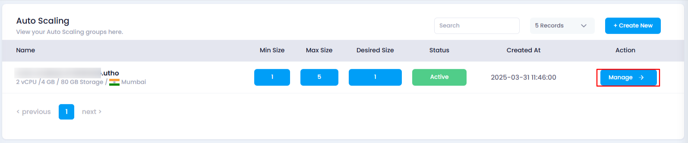
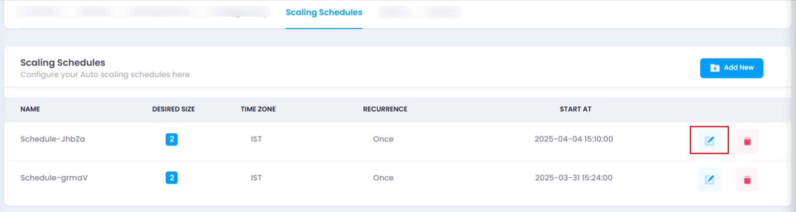
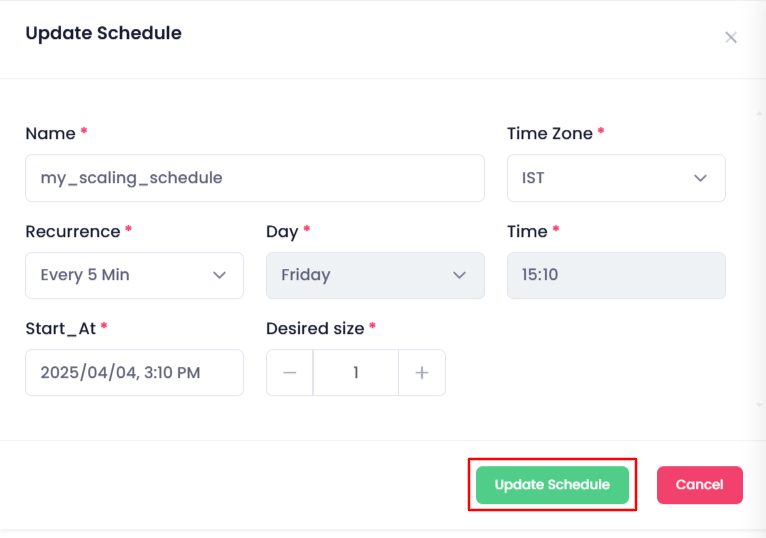
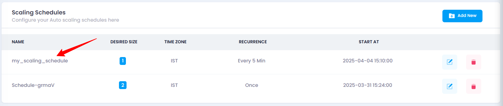

# **How to Update Scaling Schedule**

## **Overview**

Updating a scaling schedule allows you to modify the recurrence, desired size, time, and other configuration settings to better suit your auto scaling needs. This helps in adjusting your auto scaling strategy for changing requirements.

## **Login or Sign Up**

1. Visit the **Utho Cloud Platform** [login](https://console.utho.com/login) page.
2. Enter your credentials and click  **Login** .
3. If you’re not registered, sign up [here](https://console.utho.com/signup).

## **Steps to Update a Scaling Schedule**

1. **Navigate to the Auto Scaling Listing Page**
   * Navigate to the **Auto Scaling** listing page in your account, or click [here ](https://console.utho.com/auto-scaling "Auto Scaling Listing Page")to directly access it.
2. **Select the Desired Auto Scaling Instance**
   * Find the auto scaling instance you want to modify and click the **Manage** button next to it.

     
3. **Locate the Scaling Schedules Section**
   * In the **Manage** page, look for **Scaling Schedules** section, click on it. Here you can see a list of all the scaling schedules associated with the selected auto scaling instance.

     
4. **Click on the Edit Icon**
   * In the list of scaling schedules, find the specific schedule you want to update. At the end of that schedule’s entry, you will see an **edit icon** (pencil icon). Click on it to open the update drawer.
5. **Update the Scaling Schedule Configuration**
   * In the drawer that opens, you can modify the following settings:
     * **Name** : Provide a unique name for the scaling schedule.
     * **Desired Size** : Set the number of instances you want to maintain during the scheduled time (minimum 1).
     * **Time Zone** : Select the time zone for the scaling schedule (e.g., IST, UTC).
     * **Recurrence** : Choose how often the scaling action should repeat (e.g., Every 5 minutes, Every 30 minutes, Every 1 hour).
     * **Day** : Select the specific day for the scaling action (fixed to today’s date). If the recurrence is set to weekly, you can select a different day.
     * **Time** : Set the exact time for the scaling action to trigger (fixed to the current time). If recurrence is changed to every day or week, you can modify this.
     * **Start At** : Define the exact start date and time for the schedule.

       
6. **Click on the "Update Schedule" Button**
   * After making the necessary changes, click the **Update Schedule** button to save the updated schedule.
7. **Verify the Updated Scaling Schedule**
   * Once the schedule is updated, a success message will appear. You can verify the changes by checking the list of scaling schedules in the **Scaling Schedules** section. If the updates are reflected in the list, the scaling schedule has been successfully updated.

     

---

### **Impact of Updating a Scaling Schedule**

* **Time-Triggered Scaling** : The updated scaling schedule will now trigger scaling actions at the new times and intervals, ensuring resources are adjusted as per the new configuration.
* **Flexible Scaling** : Changes to the recurrence or time zone allow for more customized and flexible scaling actions, improving the performance during peak or off-peak times.
