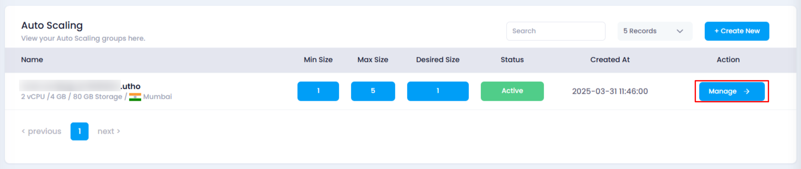
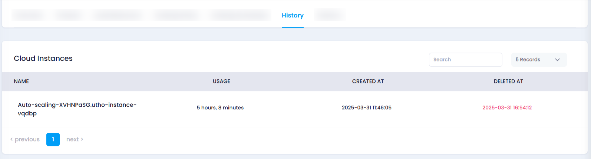

# **How to View Auto Scaling History**

## **Overview**

The **History** section provides a detailed log of events related to your auto scaling instance. You can view past actions and understand how your instance has scaled over time.

## **Steps to View Auto Scaling History**

1. **Login to Your Account**
   * Visit the **Utho Cloud Platform** [login](https://console.utho.com/login) page.
   * Enter your credentials and click  **Login** .
   * If you’re not registered, sign up [here](https://console.utho.com/signup).
2. **Navigate to the Auto Scaling Listing Page**
   * From your dashboard, go to the **Auto Scaling** listing page.
3. **Select the Desired Auto Scaling Instance**
   * Find the auto scaling instance for which you want to view the history.
   * Click on the **Manage** button next to the selected instance.

     
4. **Locate the History Section**
   * In the **Manage** page, scroll down to find the **History** section.
   * Here, you will see a list of historical actions and events related to the selected auto scaling instance, such as scaling actions, changes in configuration, and more.

     
5. **Review the History Log**
   * Browse through the history logs to understand the events that have taken place, such as when the instance scaled up or down, and any changes in the scaling configuration.
