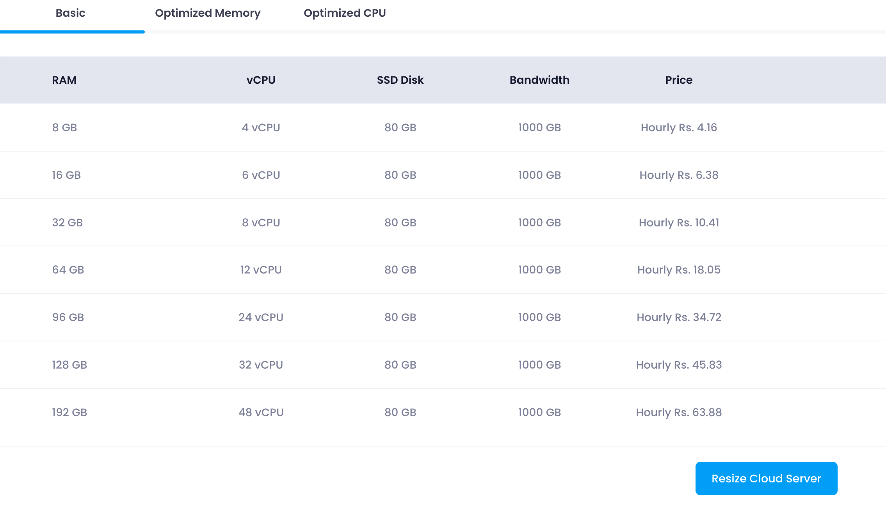

Utho's resize plans allow users to upgrade or downgrade their cloud server's resources by selecting from predefined plans.

Resizing a server in the cloud offers several benefits:

1. **Resource Optimization** : Resizing allows you to adjust CPU, memory, or storage based on current needs, ensuring you're not over-provisioning (which saves costs) or under-provisioning (which improves performance).
2. **Scalability** : You can scale up (increase resources) during high-demand periods or scale down (decrease resources) when demand decreases, helping to manage workloads efficiently.
3. **Cost Efficiency** : By resizing, you can align server resources with actual usage, preventing unnecessary costs associated with underutilized or over-provisioned resources.
4. **Improved Performance** : Resizing can enhance server performance, ensuring faster processing and better handling of applications, especially when traffic spikes.
5. **Flexibility** : Cloud platforms allow for easy resizing without downtime, providing flexibility to adapt to changing workloads or business requirements.

There are two types of resize plans available:

### 1. RAM, CPU Plans

Users can choose a plan that includes only RAM and CPU configurations. This type of plan is ideal for users who need to adjust their server's processing power and memory without altering the storage capacity. The available configurations typically include:

To resize using a RAM, CPU plan:

1. **Select a Plan** : Choose a suitable plan from the list.
2. **Resize Button** : Click the "Resize" button at the bottom of the section.

Once the plan is selected and the resize button is clicked, the server will begin the resizing process to match the selected RAM and CPU configuration.

### 2. Disk, RAM, CPU Plans

Users can choose a plan that includes Disk, RAM, and CPU configurations. This type of plan is suitable for users who need to adjust their server's processing power, memory, and storage capacity. The available configurations typically include:

To resize using a Disk, RAM, CPU plan:

1. **Select a Plan** : Choose a suitable plan from the list.
2. **Resize Button** : Click the "Resize" button at the bottom of the section.

Once the plan is selected and the **Resize Cloud Server** button is clicked, the server will begin the resizing process to match the selected disk, RAM, and CPU configuration.

---
