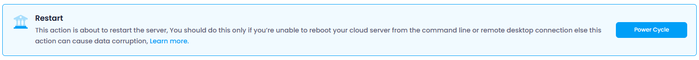

Users can manage the power state and access settings of their cloud instance. The available options include:

### Restart :

Reboots the cloud instance. This involves shutting down and then starting the cloud instance again. It is useful for applying updates or changes that require a restart to take effect.

Restarting a server offers several benefits:

1. **Performance Improvement** : Clears temporary files, memory caches, and resets system processes, improving overall performance.
2. **Troubleshooting** : Helps resolve issues like system errors, application crashes, or slow performance by reloading the server.
3. **Updates and Patches** : Applies pending updates, security patches, or configuration changes that require a reboot to take effect.
