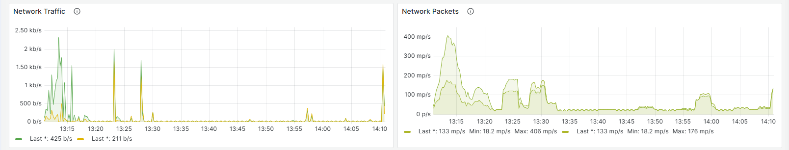

Monitor cloud instance using various charts. These charts provide insights into different performance metrics over selected periods. Available charts include:

**Cloud monitoring** involves tracking the performance, availability, and health of cloud resources like servers, storage, and applications. It helps detect issues, optimize resource usage, and ensure security. 

* **CPU Usage** : Tracks the CPU utilization over time.
* **Memory Usage** : Displays the amount of memory being used.
* **Network Traffic** : Monitors the amount of data being transmitted and received. Refers to the flow of data across a network, including both incoming and outgoing information between devices. It represents the volume of data being transmitted and is monitored to ensure optimal performance and security.
* **Network Packets** : Tracks the number of packets being sent and received. Is a small unit of data transmitted over a network. It contains a header (with routing information) and payload (the actual data being sent), enabling efficient and reliable data delivery.
* **Disk Read** : Shows the amount of data being read from disk. **Disk read** refers to the process of retrieving data from a storage device (e.g., hard drive or SSD) to be used by the system. It involves accessing the data stored in files or databases. High disk read speeds are crucial for quick data retrieval and application performance.
* **Disk Write** : Displays the amount of data being written to disk. **Disk write** is the process of saving data to a storage device from the system or application. It occurs when new data is created or existing data is modified. Efficient disk write speeds are essential for tasks like saving files, writing logs, or updating databases without performance delays.

  
* **Bandwidth** : It refers to the maximum rate at which data can be transmitted over a network connection, typically measured in bits per second (bps). Higher bandwidth allows for faster data transfer, enabling smoother performance for applications like video streaming and file transfers.

  * **Inbound Total** : The total amount of inbound bandwidth. **Inbound Bandwidth** refers to the data that is being received by your server or network from external sources, such as users accessing a website or downloading files. It's the **incoming traffic** to your system.
  * **Outbound Total** : The total amount of outbound bandwidth. **Outbound Bandwidth** refers to the data sent from your server or network to external sources, such as users downloading files or the server sending data to the internet. It's the **outgoing traffic** from your system.
* **Bandwidth Chart** : Provides a detailed view of both inbound and outbound bandwidth over time.

Users can select the period for which they want to view these charts from a dropdown menu. The available periods are:

* 1 Hour
* 12 Hours
* 7 Days
* 1 Month
* 3 Months
* 6 Months
