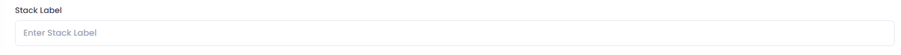
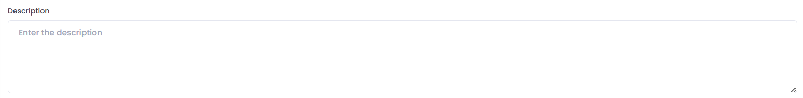
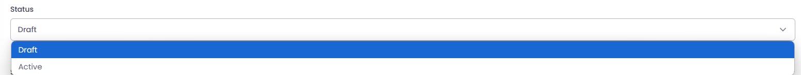
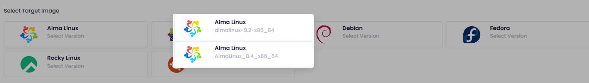
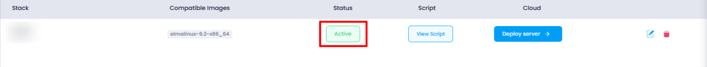
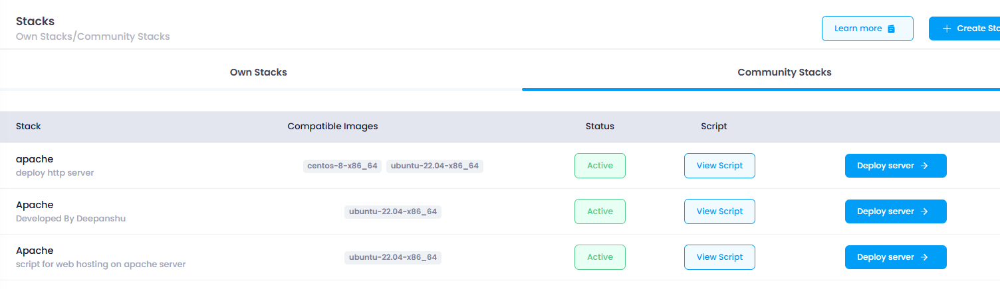
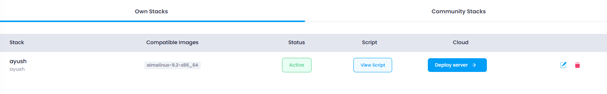
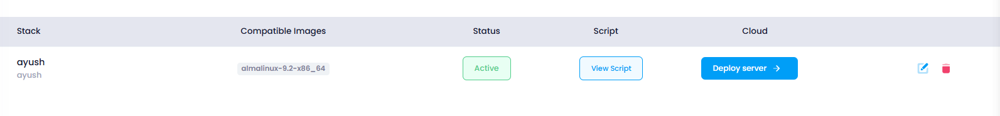

# **How to create Stacks**

## **Login or Sign Up**

1. Go to the **Utho Cloud Platform** [login](https://console.utho.com/login) page.
2. Enter your credentials and click  **Login** .
3. If you don't have an account, sign up [here](https://console.utho.com/signup).

---

## **Accessing Stacks**

1. Open the **Utho Cloud Platform** dashboard.
2. Click on **"Stacks"** in the sidebar.
3. You will be redirected to the **Stacks** listing page.
4. Click on **[Create Stacks](https://console.utho.com/Stacks/deploy ".")** to open the deployment page.

On the  **Deploy Page** , configure the following:

1. **Enter Stack Details**:

   - On the Deploy Page, fill in the following details:
     - **Stack Label**: Provide a label for the stack.

       
     - **Description**: Add a brief description of the stack.

       
     - **Status**: Select the status for your stack from dropdown.

       
     - **Target Image**: Select the target image for the stack.

       
     - **Script**: Choose or provide the script that will be used.

       
2. **Create the Stack**:

   

   - After entering all the required details, click on **Create Stack.**
3. **Stack Creation Confirmation**:

   

   - Once the stack is created, it will be reflected on the **Stacks Homepage**.

## Community Stacks

A **community cloud stack** refers to a cloud computing model where infrastructure, services, and resources are shared among several organizations with similar interests, security, or compliance requirements. Unlike a **public cloud** (open to any organization) or a **private cloud** (dedicated to a single organization), a community cloud is a collaborative environment designed to serve a group of businesses or entities that have common needs.

### Key Characteristics:

- **Shared Infrastructure**: Multiple organizations share the same cloud resources but maintain some level of isolation and control.
- **Customization**: Tailored to meet the specific needs of the community, such as regulatory compliance, industry standards, or security protocols.
- **Cost Efficiency**: The cost of infrastructure and maintenance is shared among the participants, reducing the financial burden on individual organizations.
- **Governance & Control**: Each participating organization may have influence over governance and the cloud platform's policies, but shared ownership means collaborative management.

### Own Stack & Community Stack Overview

On the **Stack Homepage**, each stack is displayed with the following information:

1. **Name**: The name of the stack that was provided during its creation.
2. **Compatible Image**: The image selected for the stack during the setup process.
3. **Status**: The stack status will display either **Active** or **Draft**, depending on the user's selection during creation.
4. **Script Section**:

- Under the **Script** section, there is an option to **View Script**.
- Clicking on **View Script** will display the script that was added to the stack.
- **Cloud Section**:
- - Under the **Cloud** section, there is an option to **View Server**.
  - Clicking on **View Server** will redirect the user to the particular server attached to the stack.
- **Edit Icon**:

  - Clicking on the **Edit** icon will open a drawer, allowing the user to **Edit** the stack’s details.
- **Delete Icon**:

  - Clicking on the **Delete** icon will trigger a **Confirmation Pop-up**.
  - Upon confirmation, the stack will be permanently deleted.

This layout enables easy management of stacks, providing options to view, edit, and delete, as well as access associated scripts and servers.

### **Stack Listing Page :**

On the  **stack listing page** , users can manage their stacks and perform various actions based on the displayed information. Here are the key features available:

1. **Stack Name** : The name of each stack is displayed, which helps users easily identify and differentiate between stacks.
2. **OS Image** : The operating system image associated with each stack is listed, showing the OS version or type used in the stack.
3. **Stack Status** : Users can see the current **status** of the stack (e.g., Active, Inactive, Pending), helping them quickly understand the state of their resources.
4. **Stack Script** : The script (if provided) associated with the stack is displayed, allowing users to view any configuration or automation script that has been included in the stack.
5. **Edit Icon** : By clicking the  **Edit icon** , users can modify the details of the stack, such as changing configurations or resources associated with it.
6. **Delete Icon** : The **Delete icon** allows users to remove unwanted stacks. When clicked, the stack and its resources will be permanently deleted.
7. **Deploy Server Button** : Clicking on the **Deploy Server** button will either:

* Redirect the user to the **cloud deployment page** if the stack is not yet deployed.
* Or, if the stack is already attached to a server, it will redirect the user to the **management page** of the specific cloud server that the stack is associated with.

These features help users efficiently manage and deploy cloud stacks, allowing for easy editing, deletion, and deployment of servers associated with the stacks.

## Support

For additional help with **Stacks** or if you encounter any issues, contact **Utho Support** through:

- The **Support Ticket System**
- Email: 📩 **[support@utho.com](support@utho.com)**

---
