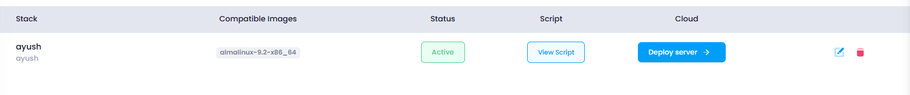
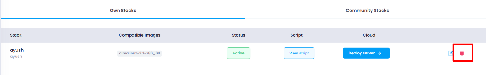
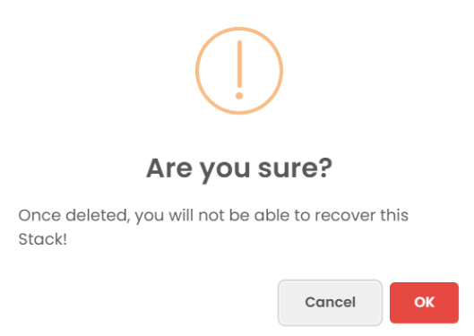

## Deleting Stacks

### Steps for Stack Deletion

1. **Navigate to the Stack Listing Page** :

   

* The user accesses a page where all the stacks are listed. This could be a table or a grid displaying stack names and related information.

1. **Select the Stack to Delete** :

   

* The user identifies the stack they want to delete.
* This could be done by clicking on a **delete icon** (such as a trash bin or a cross symbol) beside the stack they wish to delete.

1. **Show Confirmation Popup** :

   

* Once the delete icon is clicked, a confirmation dialog or modal window should appear, asking the user to confirm the deletion.

1. **Allow Permission for Deletion** :

* After the user clicks  **OK** , they are asked to confirm their action or grant any necessary permissions for deletion, if required (e.g., confirming the user is authorized to delete).

1. **Delete the Stack** :

* Once the user confirms (clicks  **OK** ), the stack is removed from the listing. The deletion process should be triggered in the backend (typically via an API call).
* After a successful deletion, the stack should be removed from the front-end view, so the listing gets updated in real-time.
