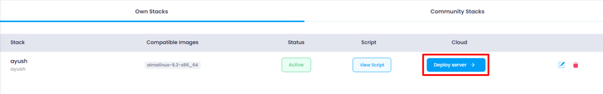

### Updated Steps for Deployment

1. **Navigate to the Stack Listing Page** :

* The user accesses the stack listing page where all the stacks are displayed.

2. **Click on "Deploy Server" Button** :

   

* The user clicks the **Deploy Server** button next to the stack they wish to deploy.

3. **Redirect to Cloud Deployment Page** :

* Upon clicking the **Deploy Server** button, the user is redirected to the **Cloud Deployment Page** where they can configure the deployment details.

**Fill in the Required Details** :

* The user fills out the deployment form, which might include:
  * DC Location
  * Instance type
  * Storage size (e.g., in GB)

4. **Click on "Deploy" Button** :

* Once all the required details are filled, the user clicks the **Deploy** button to initiate the deployment.

5. **Deploy the Server** :

* The backend API will handle the deployment process using the given details.

6. **Completion and Confirmation** :

* The user is notified of the successful deployment
