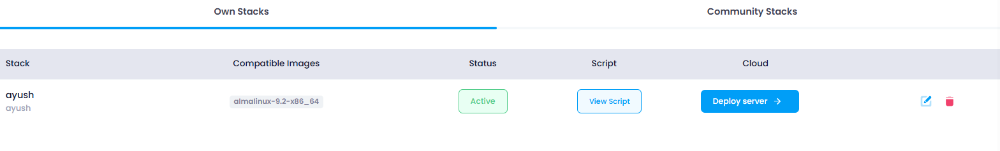
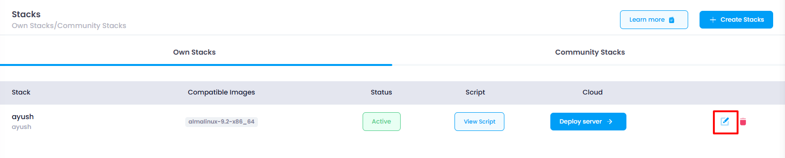

### Steps for Stack Update

1. **Navigate to the Stack Listing Page** :

   

* The user accesses the page where all the stacks are listed (similar to the delete flow).

2. **Click on the Edit Icon** :

   

* The user identifies the stack they want to update.
* They click the **edit icon** next to the stack they want to update.

3. **Open the Drawer with Stack Details** :

   

* Once the edit icon is clicked, a **drawer** component opens from the side of the page, displaying all the current details of the selected stack.
* The details should be pre-filled, reflecting the stack's current state when it was deployed.

4 **Allow Changes to the Stack Details** :

* The user can modify the details in the drawer, such as the stack name, configuration settings, or other relevant fields.

5. **Click on "Update Stack"** :

   

* After making the desired changes, the user clicks the **Update Stack** button to submit the changes.
* On click it will update the stack.
