## **Login or Sign Up**

1. Go to the **Utho Cloud Platform** [login](https://console.utho.com/login) page.
2. Enter your credentials and click  **Login** .
3. If you don't have an account, sign up [here](https://console.utho.com/signup).

---

## **Accessing Elastic Block Storage**

1. Open the **Utho Cloud Platform** dashboard.
2. Click on **"Cloud Instances"** in the sidebar.
3. You will be redirected to the **Cloud Instances** listing page.
4. Click on **[Deploy New ](https://console.utho.com/cloud/deploy ".")** to open the deployment page.

#### Configure Cloud Settings:

Here you can configure your cloud deployment details.

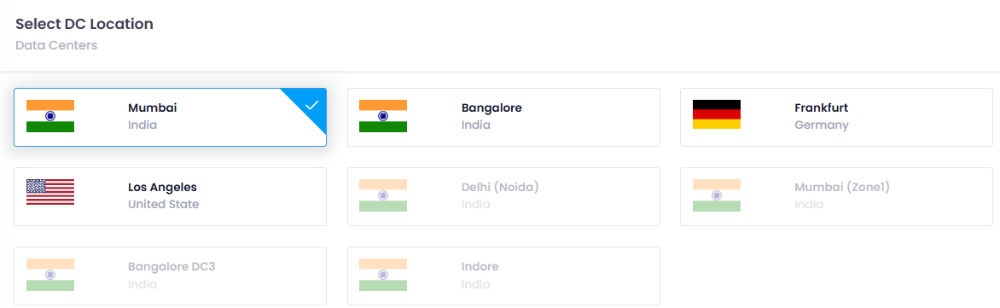

1. **Choose Datacenter Location: DC Location** refers to the **physical data center** or **region** where cloud infrastructure is hosted. It is useful for reducing  **latency** , ensuring **compliance** with local data laws, and providing **high availability** and **disaster recovery** by distributing resources across multiple locations.
2. ##### Select Image:

   Choose a image from the following image types to define the operating environment for your server:*

   * **Operating System** :

     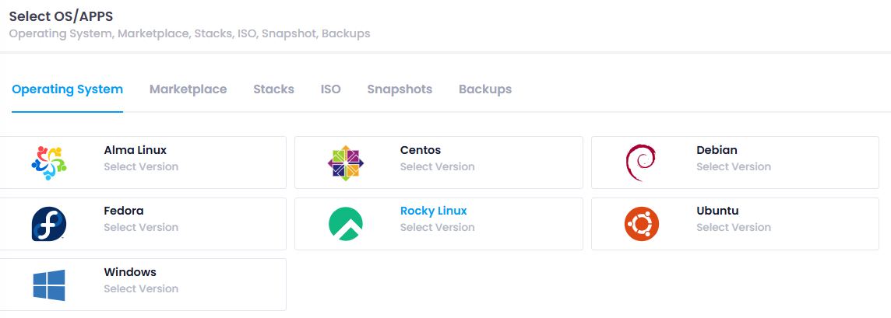
   * Refers to a **pre-configured operating system** image (e.g.,  **Ubuntu** ,  **Windows Server** ,  **CentOS** ) that will be installed on the instance. It provides the basic platform for running applications. Select an operating system such as Ubuntu, CentOS, Fedora, Rocky Linux, AlmaLinux, Debian, or Windows.
   * **Marketplace** :

     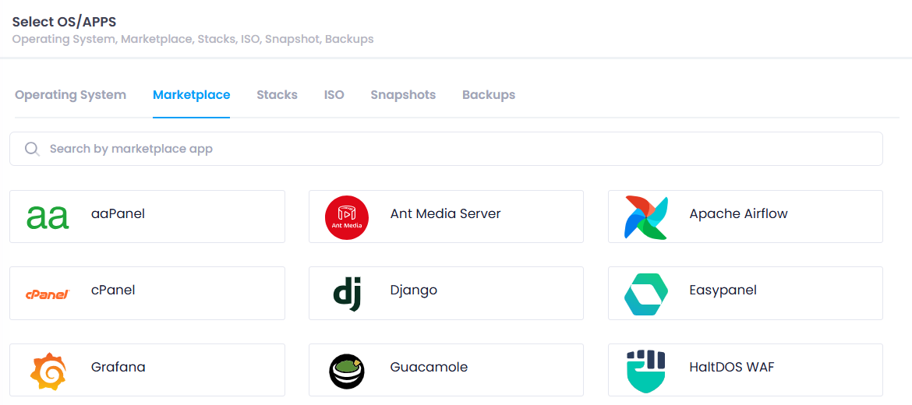 Offers **pre-packaged software** or **solutions** (like a  **web server** ,  **database** , or **CRM** software) that are ready to deploy. These images often come with additional configurations and setups specific to certain use cases. Choose from over 20+ marketplace applications to deploy ready-to-use software solutions.

     Once any data is selected from the marketplace then it will ask for the configuration section where it will ask for for further details as shown in the snippet. Mostly it ask to select **OS**.
   * **Stack** : Select from two types of stacks:

     A  **stack**  typically refers to a collection of **software technologies** (e.g., **LAMP stack** for Linux, Apache, MySQL, PHP) that are bundled together. Selecting a stack allows you to deploy a predefined set of technologies on your instance.

     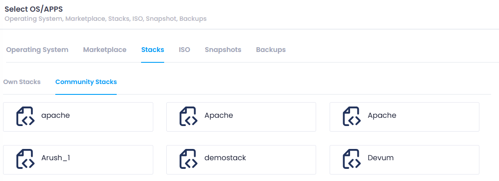

     **Own Stack** : Private stacks that are accessible only by the user who created them.

     **Community Stack** : Public stacks that are accessible by any user.
   * **ISO** : 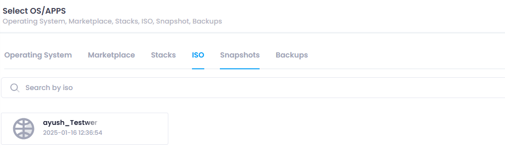**ISO images** are disk image files (like  **bootable ISO files** ) that contain a full operating system or custom software setup. You can upload and use your custom **ISO image** for full control over the OS installation process. Choose an ISO image to deploy a custom operating system or software environment.
   * **Backup** : A **backup image** is similar to a snapshot but often includes  **longer-term backups** . It's used to restore the instance to a previous, stable state in case of failure or data loss. Choose a backup image to recover data from a previous backup.
3. **Select Storage Type:** There are two type of Storage type **General** and **Elastic Block Storage.
   **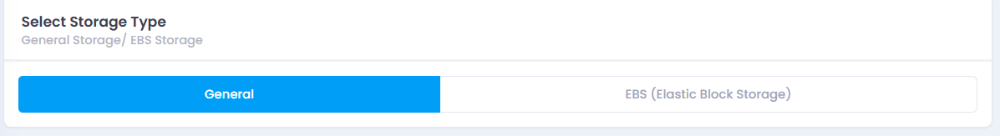
   General Storage  & EBS Storage Type:****

   * **General Storage** refers to standard storage options used for typical, non-performance-intensive applications.
   * It is designed for **cost-effectiveness** and is used for storing data that doesn't require high-speed access or frequent modifications.
   * General storage is often used for  **archiving** ,  **static files** , and other data that is not accessed or modified regularly.
   * **Examples** include cloud services like **S3 Standard** for object storage or basic storage solutions in cloud environments.
   * It offers a **balance** between cost and performance, suitable for applications where speed is not the primary concern.
   * **EBS (Elastic Block Store)** is a high-performance, **persistent block storage** service in cloud environments like AWS, used for  **applications requiring fast data access** .
   * It is typically attached to  **cloud instances** , providing storage that acts like a hard disk or SSD, allowing data to persist even after instance termination.
   * EBS volumes are used for  **database storage** ,  **file systems** , and workloads that need **low-latency** and  **high-throughput** .
   * There are different types of EBS volumes like  **gp2** ,  **gp3** ,  **io1** , and  **io2** , each optimized for specific performance needs.
   * EBS provides  **durability and scalability** , making it suitable for enterprise applications where data integrity and performance are critical.
4. **Configure Billing Cycle:**

   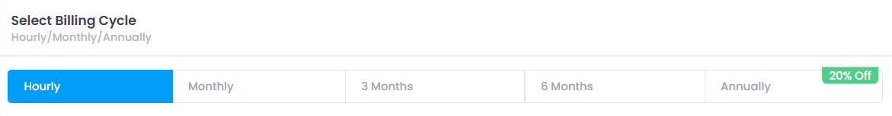

   **Billing Cycle:

   **

   A **billing cycle** in cloud refers to the **period of time** during which a cloud service provider charges you for the services and resources you've used. The billing cycle determines how often you'll receive invoices and how often you'll be billed for your cloud services. Common billing cycles in the cloud are:

   * **Hourly** : Charges are based on the **number of hours** you use the cloud service.
   * **Monthly** : Charges are billed  **monthly**, **3 months, 6 months** often at the end of the month.
   * **Annually** : Charges are billed  **once a year** , often with **20%** or more  **discounts** for long-term commitments.
5. **Select Plan** :

   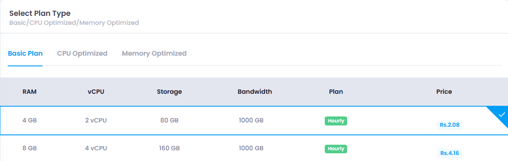

   The **Basic Plan** is a budget-friendly option designed for small projects or applications that don't require high resources, ideal for development or testing environments.

   The **CPU Optimized Plan** is aimed at workloads that demand higher processing power, such as data processing or compute-intensive applications, offering more CPU cores and faster performance.

   The **Memory Optimized Plan** is suited for applications that require a lot of memory, like databases or analytics workloads, providing increased RAM.

   **Custom Plans** , allowing businesses to configure specific resources like CPU, memory, and storage to meet unique application or workload requirements, providing greater flexibility and control over the cloud environment.

* Choose a plan that matches your performance requirements, including CPU, RAM, and storage options.

##### Now if the storage is General then "Setup Auth Configuration" will occur and if storage is EBS then "Configure storage" section will occur.

6. **Setup Auth Configuration:**

   Configure authentication for accessing your server:

* **Password Authentication** : Provide a secure password for the server.
* **SSH Key Authentication** : Upload an SSH key for more secure and convenient access.

7. **Configure Storage: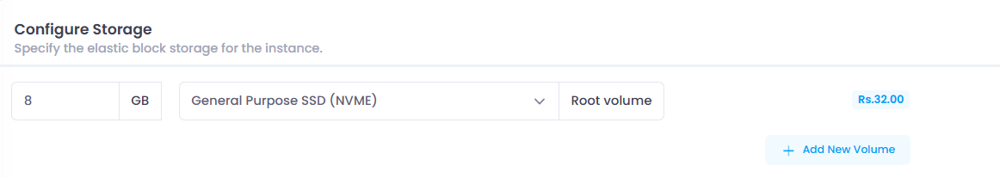**

   **Configuring storage in EBS** involves selecting the right **volume type** (e.g.,  **general purpose SSD** ,  **provisioned IOPS SSD** ,  **HDD** ), setting the **size** based on storage needs, and determining **performance** (e.g., IOPS for high-demand workloads). You can also enable **encryption** for data security and use **snapshots** for backups. Configuring EBS storage ensures that data is persistent, secure, and optimized for your cloud instance's needs.

   Also user can add more storage by clicking on the  **"Add New Volume Button".**
8. **Auth Configuration: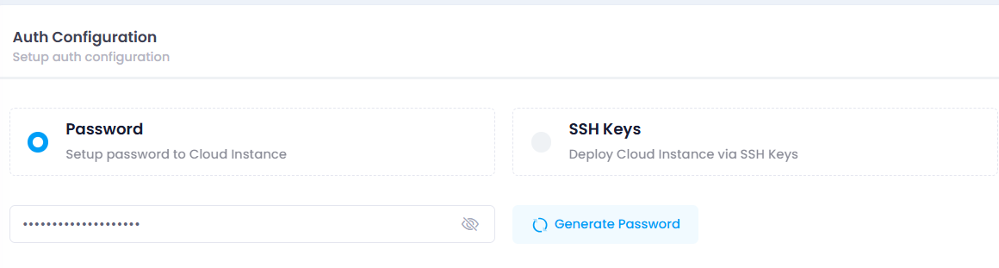**

   ### 1. **Password Authentication & SSH Keys**

   * **How it Works** : Users provide a password to access the server.
   * **Benefits** :
   * Simple to set up and use.
   * Widely supported across systems.
   * User-friendly for non-technical users.
   * **Drawbacks** :
   * Vulnerable to brute-force and dictionary attacks.
   * Risk of password theft via phishing or keylogging.
   * Less secure if the password is weak or reused.
   * **Use Case** : Best for simple, low-risk environments or quick ad-hoc access.
   * **SSH Keys**
   * **How it Works** : Users authenticate using a cryptographic key pair (public and private keys).
   * **Benefits** :
   * Stronger security (no passwords transmitted).
   * Resilient to brute-force attacks.
   * Supports automated logins for scripts or CI/CD pipelines.
   * No risk of phishing attacks.
   * **Drawbacks** :
   * Initial setup is more complex.
   * Requires managing and securing private keys.
   * **Use Case** : Ideal for secure, automated access in production environments, cloud systems, and large-scale server management.
9. **Public IP:** A **Public IP** in a cloud server is an IP address that allows external access to the server from the internet. Enabling a **public IP** makes the server reachable from anywhere, which is essential for hosting websites, APIs, or services. **Disabling** it removes internet access, making the server accessible only within the private cloud network, enhancing security. You can enable a public IP during server creation or assign it later, while disabling it typically involves releasing the IP or adjusting firewall settings. Public IPs are often dynamic by default but can be made static for consistency.
10. * **VPC Network** :  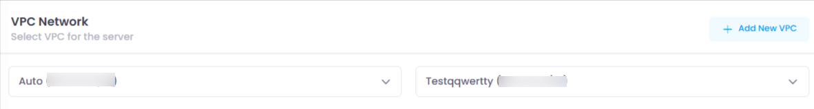A **Virtual Private Cloud (VPC)** is a private, isolated network within a cloud environment, allowing you to securely launch and manage resources like virtual machines and databases. It gives you full control over network configurations, IP ranges, and security settings. **Subnets** are divisions within a VPC that help organize resources; **public subnets** provide internet access, while **private subnets** are isolated for sensitive resources. VPCs enhance security, enable flexible network design, and allow you to configure traffic flow using firewalls and route tables. They also help improve scalability and high availability by distributing resources across multiple availability zones.Select a Virtual Private Cloud (VPC) network available at your chosen location to isolate and secure your cloud environment. Also you can create vpc is there is no vpc on the selected dc loaction.
    * **Firewall** : 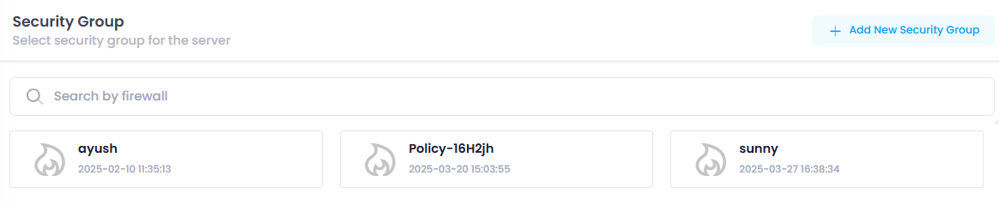A **firewall** is a security system that monitors and controls incoming and outgoing network traffic based on predefined security rules. In cloud servers, firewalls help protect against unauthorized access by filtering traffic, ensuring only trusted sources can communicate with your server. They can be configured to allow or block specific IP addresses, ports, or protocols. Cloud providers offer **virtual firewalls** (like AWS Security Groups or Azure Network Security Groups) to protect instances and resources. Firewalls enhance security by controlling access to both public and private cloud resources, preventing potential attacks such as unauthorized access or DDoS (Distributed Denial of Service) attacks.Enable or disable firewall protection to control incoming and outgoing traffic.Also you can create firewall if there is no firewall.
    * **CPU Mpdel:**

      **Intel** and **AMD** are the two major CPU manufacturers. Intel is known for its strong **single-core performance** and features like **Hyper-Threading** and  **Turbo Boost** , commonly used in high-performance laptops and workstations. Popular Intel models include **Core i3, i5, i7, i9** and **Xeon** for servers.  **AMD** , on the other hand, offers better **multi-core performance** and value for money, especially in gaming and parallel processing tasks. Popular AMD models include **Ryzen 3, 5, 7, 9** and **EPYC** for servers. AMD CPUs are generally praised for their price-to-performance ratio, while Intel tends to dominate in single-threaded applications.
    * **Label** : 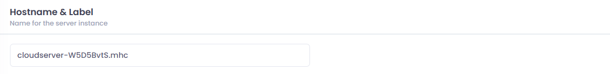Provide a descriptive name for your cloud server to easily identify it in your dashboard.
    * 
    * **Number of Servers** :

      
    * **Instance Quantity** refers to the number of virtual machine (VM) instances running in a cloud environment. It determines how many separate computing resources are allocated for your applications or services. You can increase the instance quantity to handle more traffic or scale down during low demand. This directly impacts  **cost** , as cloud providers charge based on the number of active instances. Managing instance quantity involves launching, stopping, or terminating instances based on workload needs. It helps with  **scalability** , ensuring resources are available when needed. Overall, it's a key factor in optimizing performance and controlling cloud costs. Specify the number of cloud servers to deploy simultaneously with the same configuration.
11. **Cost Summary:**

    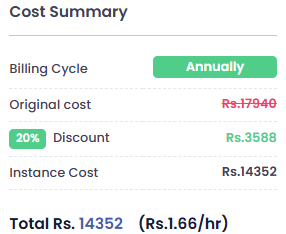

    Review the cost summary on the right side of the interface to see a detailed breakdown of the costs associated with your selected configuration.
12. **Apply Coupon:**

    

    If you have a coupon code, apply it to receive a discount on your deployment. By doing so user will get additional benefits.
13. **Deploy Cloud**:

    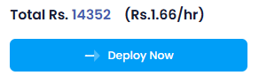

    Click the 'Deploy Cloud' button to initiate the deployment process. The system will start provisioning your cloud server(s) based on the specified configuration.

#### Verify Deployment:

Your Cloud should now be  visible in the manage section of deployed Cloud.

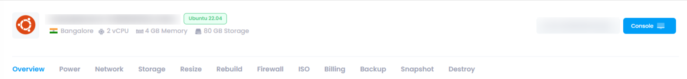

Here you can see your deployed cloud with configuration details your provided during the deployment process and you can manage your cloud by clicking on mange button, for detailed info check for the manage cloud section in the Utho docs
