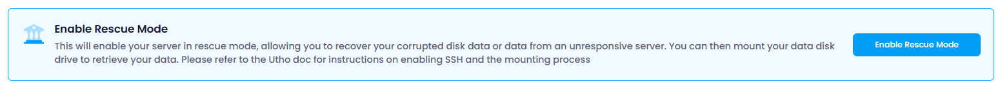

Users can manage the power state and access settings of their cloud instance. The available options include:

### Enable Rescue Server :

Boots the cloud instance into a rescue mode. This is useful for recovering from system failures or performing maintenance tasks. In rescue mode, users can access the file system and troubleshoot issues that prevent the normal boot process.

Enabling a **rescue server** offers several key benefits:

1. **System Recovery** : It allows you to troubleshoot and fix issues (e.g., corrupted OS or boot problems) without affecting the primary server.
2. **Data Access** : Provides a way to recover or back up critical data from a compromised or unbootable server.
3. **Repair & Maintenance** : Enables performing system repairs, software reinstallation, or reconfiguration without downtime on the main server.
4. **Isolation** : Ensures that the main server remains unaffected while the rescue server is used for diagnostics and fixes.
