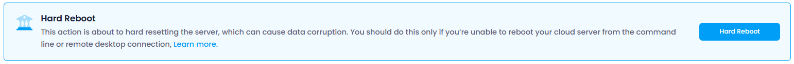

Users can manage the power state and access settings of their cloud instance. The available options include:

### Hard Reboot :

 Forces an immediate reboot of the cloud instance. This is akin to pressing the reset button on a physical machine and should be used with caution as it does not allow running applications and processes to close properly, which may lead to data loss or corruption.

A **hard reboot** (or  **hard reset** ) involves forcibly restarting a server or system, typically by power cycling (turning it off and on). The benefits include:

1. **System Recovery** : It can help recover from severe system freezes or unresponsiveness when a regular reboot isn't possible.
2. **Clearing System Errors** : A hard reboot can clear hardware or software issues that may be preventing the system from functioning properly.
3. **Restoring Hardware Functionality** : It can reset malfunctioning hardware components (e.g., network interfaces or storage) and restore normal operation.
