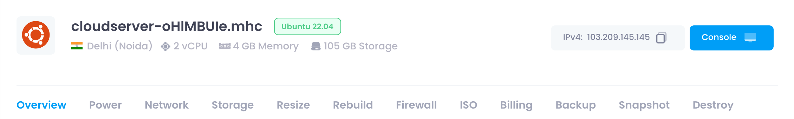

## Cloud Configuration

In the header section, users can view crucial information about their cloud instance. This includes:**Cloud Name** : The name assigned to the cloud instance.

* **Operating System (OS)** : The OS name and version running on the cloud instance.
* **Data Center Location** : The geographical location of the data center hosting the cloud instance.
* **Plan Information** :
  * **vCPU** : Number of virtual CPUs allocated.
  * **Memory** : Amount of memory (RAM) allocated.
  * **Storage** : Amount of storage allocated.
* **IPv4 Address** : The IPv4 address assigned to the cloud instance.
