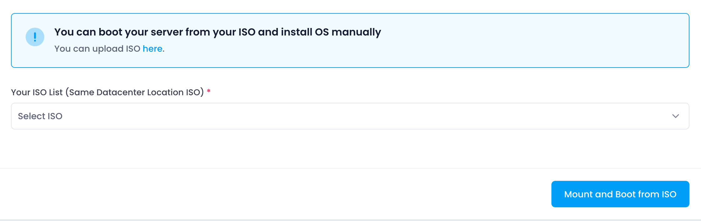
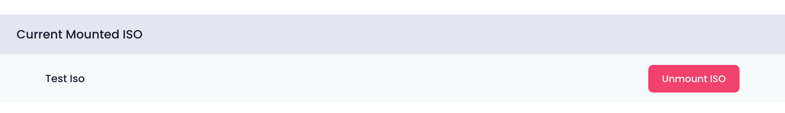

Utho provides users with the capability to boot their cloud server from ISO images, enabling manual OS installation directly from the selected ISO.

### Mounting an ISO

To mount an ISO image to your cloud server:

1. **Select ISO** : Choose an ISO image from the dropdown list of available ISOs.
2. **Mount and Boot ISO** : Click the "Mount and Boot ISO" button to initiate the mounting process.

Once mounted, the ISO image will be associated with your cloud server and will appear in the list of mounted ISOs.

### Managing Mounted ISOs

Users can manage mounted ISO images as follows:

* **View Mounted ISOs** : The list displays all currently mounted ISO images associated with the cloud server.
* **Unmount ISO** : For each mounted ISO, there is an option to unmount it from the server. This action disconnects the ISO image from the server's boot process.

### Workflow

1. **Select ISO** : Choose the ISO image containing the desired operating system or software for installation.
2. **Mount ISO** : Initiate the mounting process to start booting the server from the selected ISO.
3. **Install OS** : Follow the prompts to install the operating system manually from the mounted ISO image.

Utho's ISO management feature allows users to customize their server configurations and perform manual OS installations conveniently and securely.
