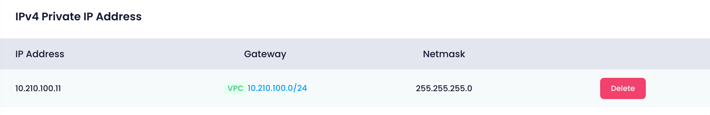

Utho's network configuration allows users to manage various network settings for their cloud instances, including public and private IP addresses and VPC (Virtual Private Cloud) assignments. This section provides detailed information on how to manage these network settings effectively.

#### IPv4 Public IP Address

In this section, users can view all public networks associated with their cloud instance. The information is displayed in a table format, including the following details for each public network:

* **IP Address** : The public IP address assigned to the cloud instance.
* **Gateway** : The gateway for the public network, which routes traffic between the cloud instance and other networks.
* **Netmask** : The subnet mask for the public network, defining the network's IP range.
* **DNS** : The DNS servers for the public network, used to resolve domain names to IP addresses.

For each public network, users have the following options:

* **Update** : Allows users to update the rDNS (reverse DNS) settings. Reverse DNS translates an IP address back to a domain name, which can be important for email servers and network diagnostics.
* **Delete** : Allows users to delete the public network. Deleting a public network will remove the associated public IP address and its configurations from the cloud instance. Click this to remove the public network. A confirmation dialog will appear to prevent accidental deletions.
* **Enable/Disable** : Allows users to enable or disable the public network. Disabling a network will temporarily deactivate the associated IP addresses.
* **Enable/Disable Toggle** : Use this switch to turn the public network on or off.

Additionally, there is a button to add an additional public IP address to the cloud instance:

* **Add Additional Public IP** : Click this button to allocate a new public IP address to your cloud instance. This will open a form where you can specify the new IP address details.

#### IPv4 Private IP Address

In this section, users can view the private networks associated with their cloud instance. Private networks are used for internal communication within the data center and are not accessible from the public internet. The table displays:

* **IP Address** : The private IP address assigned to the cloud instance.
* **Netmask** : The subnet mask for the private network.
* **Gateway** : The gateway for the private network.

For each private network, there is an option to delete it:

* **Delete** : Allows users to delete the private network. Deleting a private network will remove the associated private IP address and its configurations from the cloud instance.

#### VPC (Virtual Private Cloud)

In this section, users can select a VPC to assign to their cloud instance. VPCs allow users to create isolated networks within the cloud, providing greater control over network configurations and security. All VPCs available in the same location as the current cloud instance are listed.

To assign a VPC:

1. **Select VPC** : Choose a VPC from the list of available VPCs.
2. **Confirmation Popup** : A popup will appear with the message:
3. **Confirm Assignment** : Upon confirmation, the selected VPC (private IP) will be assigned to the cloud instance. This will integrate the cloud instance into the chosen VPC, allowing it to communicate with other resources within the VPC.
