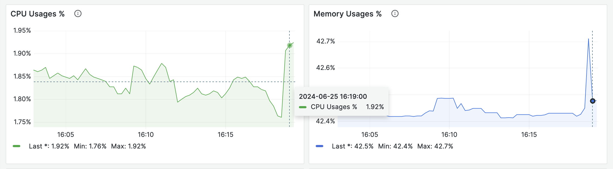
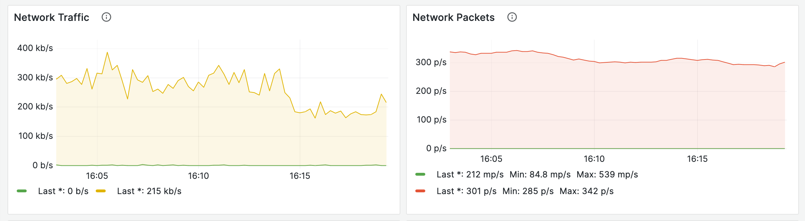
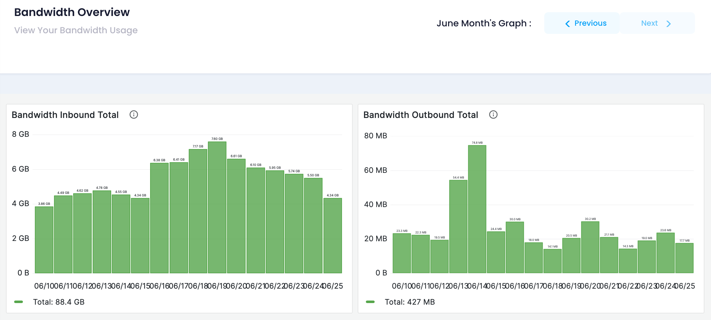

Monitor cloud instance using various charts. These charts provide insights into different performance metrics over selected periods. Available charts include:

#### Time Period Selection

A dropdown menu or button allows administrators to select the time period for which they want to view the server's performance. The available time periods include:

* 1 Hour
* 12 Hours
* 7 Days
* 1 Month
* 3 Months
* 6 Months

Here's a detailed explanation of each graph on the Server Performance Monitoring Overview page:

### CPU Usage Graph

**What it shows:** The CPU Usage graph displays the percentage of CPU resources used by the server over the selected time period.

**How it's calculated:** The CPU
usage is calculated by averaging the CPU utilization over the selected
time period. This is typically measured as a percentage of the total
available CPU resources.

**What it indicates:**

* **High CPU usage:** A high CPU usage (e.g., above 80%)
  may indicate that the server is experiencing high loads, which can lead
  to slow performance, increased latency, and even crashes.
* **Low CPU usage:** A low CPU usage (e.g., below 20%)
  may indicate that the server has excess capacity, which can be optimized
  for better performance or allocated to other tasks.

**Key metrics:**

* **Peak CPU usage:** The highest CPU usage recorded during the selected time period.
* **Average CPU usage:** The average CPU usage over the selected time period.
* **CPU usage trend:** The direction and rate of change of CPU usage over time.

### Memory Usage Graph

**What it shows:** The Memory Usage graph displays the percentage of memory resources used by the server over the selected time period.

**How it's calculated:** The
memory usage is calculated by averaging the memory utilization over the
selected time period. This is typically measured as a percentage of the
total available memory resources.

**What it indicates:**

* **High memory usage:** A high memory usage (e.g., above
  80%) may indicate that the server is experiencing memory leaks,
  inefficient memory allocation, or high memory demands from applications.
* **Low memory usage:** A low memory usage (e.g., below
  20%) may indicate that the server has excess memory capacity, which can
  be optimized for better performance or allocated to other tasks.

**Key metrics:**

* **Peak memory usage:** The highest memory usage recorded during the selected time period.
* **Average memory usage:** The average memory usage over the selected time period.
* **Memory usage trend:** The direction and rate of change of memory usage over time.

### Network Traffic Graph

**What it shows:** The Network
Traffic graph displays the total amount of network traffic (in bytes)
transmitted and received by the server over the selected time period.

**How it's calculated:** The
network traffic is calculated by summing up the total bytes transmitted
and received by the server over the selected time period.

**What it indicates:**

* **High network traffic:** A high network traffic (e.g.,
  above 100 MB/s) may indicate that the server is experiencing high
  network demands, which can lead to slow performance, increased latency,
  and even crashes.
* **Low network traffic:** A low network traffic (e.g.,
  below 10 MB/s) may indicate that the server has excess network capacity,
  which can be optimized for better performance or allocated to other
  tasks.

**Key metrics:**

* **Peak network traffic:** The highest network traffic recorded during the selected time period.
* **Average network traffic:** The average network traffic over the selected time period.
* **Network traffic trend:** The direction and rate of change of network traffic over time.

### Network Packets Graph

**What it shows:** The Network
Packets graph displays the total number of network packets transmitted
and received by the server over the selected time period.

**How it's calculated:** The
network packets are calculated by counting the total number of packets
transmitted and received by the server over the selected time period.

**What it indicates:**

* **High network packets:** A high number of network
  packets (e.g., above 10,000 packets/s) may indicate that the server is
  experiencing high network demands, which can lead to slow performance,
  increased latency, and even crashes.
* **Low network packets:** A low number of network
  packets (e.g., below 1,000 packets/s) may indicate that the server has
  excess network capacity, which can be optimized for better performance
  or allocated to other tasks.

**Key metrics:**

* **Peak network packets:** The highest number of network packets recorded during the selected time period.
* **Average network packets:** The average number of network packets over the selected time period.
* **Network packets trend:** The direction and rate of change of network packets over time.

### Disk Read Graph

**What it shows:** The Disk Read graph displays the total amount of data read from the disk by the server over the selected time period.

**How it's calculated:** The disk read is calculated by summing up the total bytes read from the disk by the server over the selected time period.

**What it indicates:**

* **High disk read:** A high disk read (e.g., above 100
  MB/s) may indicate that the server is experiencing high disk I/O
  demands, which can lead to slow performance, increased latency, and even
  crashes.
* **Low disk read:** A low disk read (e.g., below 10
  MB/s) may indicate that the server has excess disk capacity, which can
  be optimized for better performance or allocated to other tasks.

**Key metrics:**

* **Peak disk read:** The highest disk read recorded during the selected time period.
* **Average disk read:** The average disk read over the selected time period.
* **Disk read trend:** The direction and rate of change of disk read over time.

### Disk Write Graph

**What it shows:** The Disk Write graph displays the total amount of data written to the disk by the server over the selected time period.

**How it's calculated:** The disk write is calculated by summing up the total bytes written to the disk by the server over the selected time period.

**What it indicates:**

* **High disk write:** A high disk write (e.g., above 100
  MB/s) may indicate that the server is experiencing high disk I/O
  demands, which can lead to slow performance, increased latency, and even
  crashes.
* **Low disk write:** A low disk write (e.g., below 10
  MB/s) may indicate that the server has excess disk capacity, which can
  be optimized for better performance or allocated to other tasks.

**Key metrics:**

* **Peak disk write:** The highest disk write recorded during the selected time period.
* **Average disk write:** The average disk write over the selected time period.
* **Disk write trend:** The direction and rate of change of disk write over time.

### Navigation Buttons

By using the Previous and Next buttons, you can navigate through the bandwidth data and gain a deeper understanding of your server's network performance over time.

### Bandwidth Inbound Graph

**What it shows:** The Bandwidth
Inbound graph displays the total amount of incoming bandwidth (in bytes)
 received by the server over the selected time period.

**How it's calculated:** The bandwidth inbound is calculated by summing up the total bytes received by the server over the selected time period.

**What it indicates:**

* **High bandwidth inbound:** A high bandwidth inbound
  (e.g., above 100 MB/s) may indicate that the server is experiencing high
  network demands, which can lead to slow performance, increased latency,
  and even crashes.
* **Low bandwidth inbound:** A low bandwidth inbound
  (e.g., below 10 MB/s) may indicate that the server has excess network
  capacity, which can be optimized for better performance or allocated to
  other tasks.

**Key metrics:**

* **Peak bandwidth inbound:** The highest bandwidth inbound recorded during the selected time period.
* **Average bandwidth inbound:** The average bandwidth inbound over the selected time period.
* **Bandwidth inbound trend:** The direction and rate of change of bandwidth inbound over time.

### Bandwidth Outbound Graph

**What it shows:** The Bandwidth
Outbound graph displays the total amount of outgoing bandwidth (in
bytes) transmitted by the server over the selected time period.

**How it's calculated:** The bandwidth outbound is calculated by summing up the total bytes transmitted by the server over the selected time period.

**What it indicates:**

* **High bandwidth outbound:** A high bandwidth outbound
  (e.g., above 100 MB/s) may indicate that the server is experiencing high
  network demands, which can lead to slow performance, increased latency,
  and even crashes.
* **Low bandwidth outbound:** A low bandwidth outbound
  (e.g., below 10 MB/s) may indicate that the server has excess network
  capacity, which can be optimized for better performance or allocated to
  other tasks.

**Key metrics:**

* **Peak bandwidth outbound:** The highest bandwidth outbound recorded during the selected time period.
* **Average bandwidth outbound:** The average bandwidth outbound over the selected time period.
* **Bandwidth outbound trend:** The direction and rate of change of bandwidth outbound over time.
