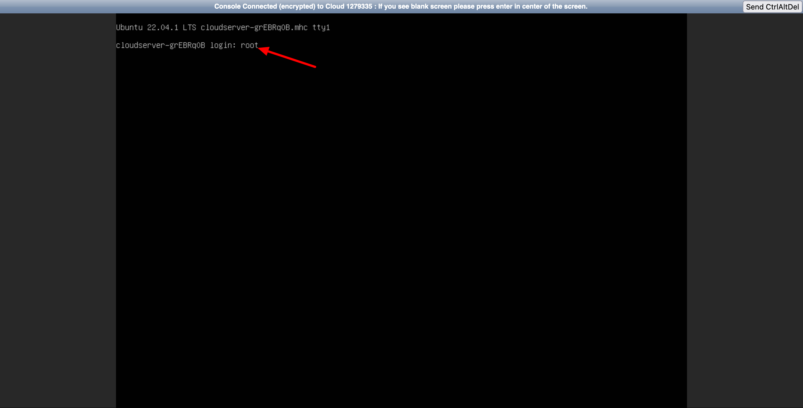
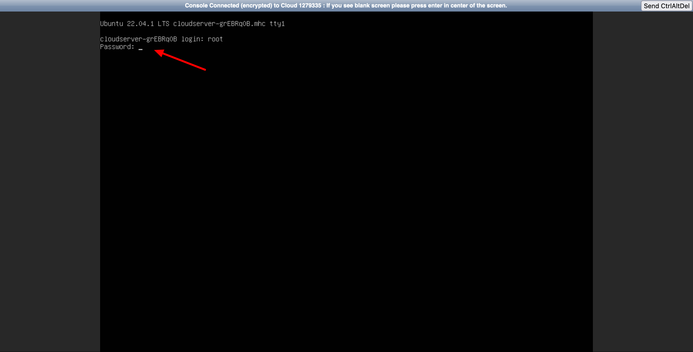
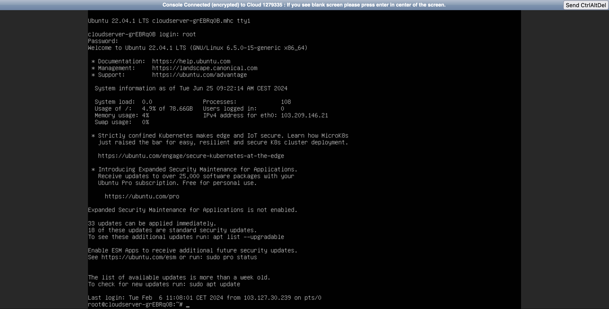

### Introduction

Managing cloud servers is a critical task for many businesses, and the Utho platform makes it simple and efficient. This article will guide you through the steps to access the console of your cloud server on the Utho platform.

### What You Need

Before starting, ensure you have:

* An active Utho account.
* Proper access rights to the cloud instance you want to manage.

### Step-by-Step Guide

##### 1. Log In to the Utho Platform

First, navigate to the Utho platform and log in with your credentials.

##### 2. Navigate to Your Cloud Instances

Once logged in, go to the 'Cloud' section from the main dashboard. Here, you'll see a list of all your cloud instances.

##### 3. Select the Instance

Click on the cloud instance for which you want to access the console. This will take you to the instance's details page.

##### 4. Access the Console

On the instance's details page, locate the 'Power' tab. Within this tab, find the 'Console Access' section and click on the 'Open Console' button.

This will open a new window with the console interface for your cloud server.

##### 5. Enter Credentials

In the console window:

1. First click on the middle of the conosle interface, then complete the auth process.
2. Enter the username of the server. By default, it's "root". This information is also sent to your email with the server configuration details.
3. Press "Enter".
4. When prompted, enter your password. Note that the password won't be visible as you type it, but it will be registered in the background.

Once you have entered the correct credentials, you will be successfully logged into the console.

### Troubleshooting Access Issues

If you encounter problems accessing the console:

* Verify the username and password.
* Ensure the server is up and running.
* Check for any firewall policies that might be blocking access.
* If issues persist, contact the Utho support team for assistance.

### Managing Your Cloud Instance

The console allows you to manage and troubleshoot your cloud server as if you were physically present at the machine. You can:

* Monitor performance and usage.
* Run administrative commands.
* Troubleshoot issues.

### Additional Tips

* **Keep your credentials secure:** Always log out after accessing the console.
* **Regular monitoring:** Regularly check the console to ensure your cloud instance is performing optimally.

Accessing the console of your cloud server on the Utho platform is a straightforward process that enhances your ability to manage and troubleshoot your cloud resources efficiently. With just a few clicks, you can take full control of your cloud instances.
