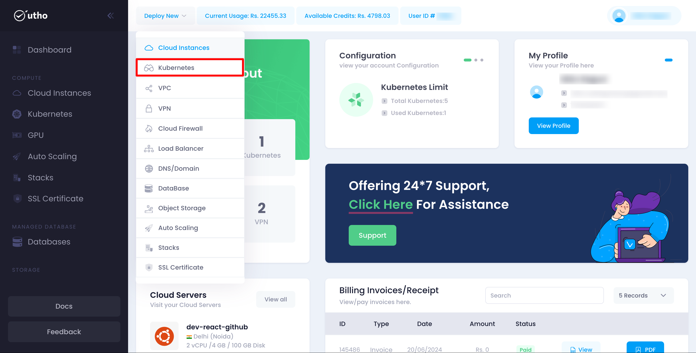
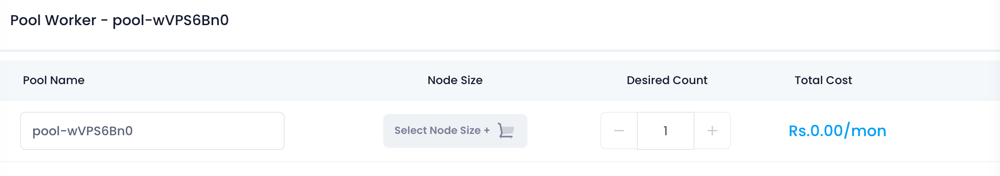
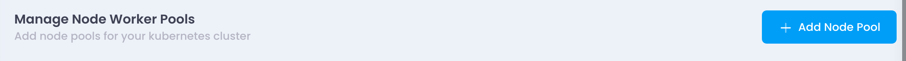
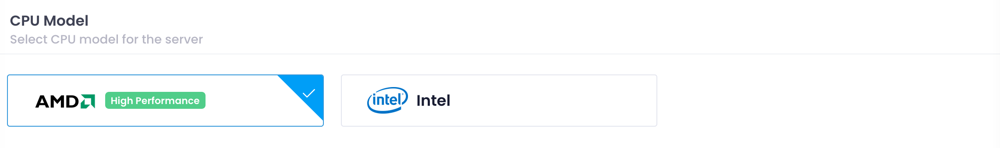
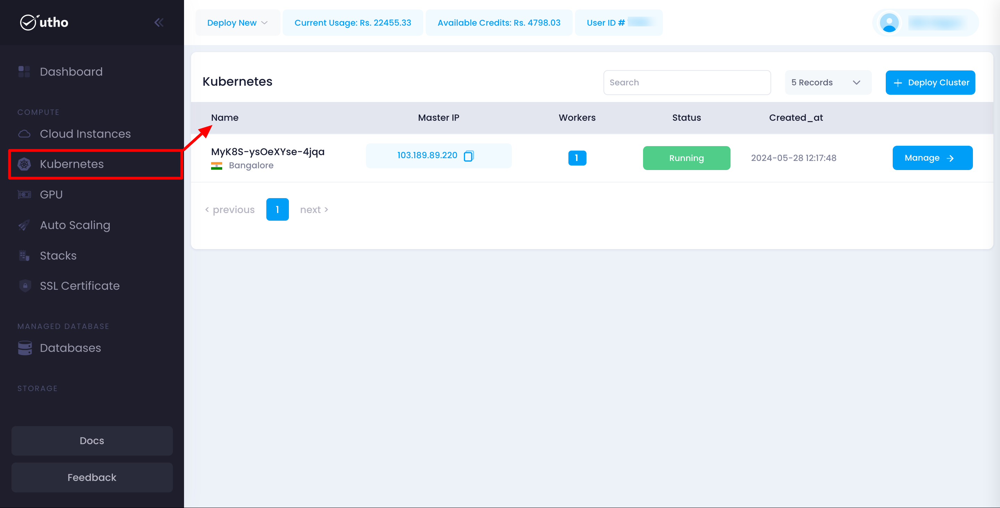

## Initial Start

* **Log in** to your account on our platform.
* **Navigate** to the top toolbar and locate the **Deploy** dropdown menu.
* **Select** the **Kubernetes** option from the dropdown.

## Quick Start

##### Open the Kubernetes Deployment Page:

Click on the **Deploy** dropdown in the top toolbar and select **Kubernetes** **Instances** .

After click on the aboveKubernetes Instances button a Kubernetes-deploy page will open

#### Configure Kubernetes Settings:

here you can configure your Kubernetes deployment details .

1. **Datacenter Location:**Choose the geographical region or datacenter location where you want to deploy your Kubernetes cluster. This choice can affect latency and compliance requirements.

   
2. **Cluster Label:**

   * Enter a descriptive label for your Kubernetes cluster. This label helps you identify and manage your clusters easily within Utho's interface.
3. **Cluster Version:**

   * Specify the version of Kubernetes you wish to deploy. Utho's Kubernetes Instance typically offers the latest stable versions for deployment.

### Configuring Node Pools

1. **Node Pool Configuration:**
   * A node pool represents a group of nodes within a Kubernetes cluster that all have the same configuration. Configure your node pool(s) with the following details:
     * **Pool Name:** Provide a name for the node pool to distinguish it from others.
     * **Node Size:** Select the size (CPU and memory configuration) for nodes within this pool.
     * **Desired Count:** Specify the initial number of nodes you want in this pool.
2. **Selecting Node Size:**
   * Click on the "Node Size" option to view available plans. A drawer will open displaying various plans with detailed specifications (CPU, memory, storage).
3. **Adding Node Pools:**
   * If your application or workload requires different configurations, click on the "Add node pool" button to create additional node pools with varying specifications.

     
4. **VPC Network** :Select a Virtual Private Cloud (VPC) network available at your chosen location to isolate and secure your cloud environment.
5. **Firewall** :Enable or disable firewall protection to control incoming and outgoing traffic.
6. **Select CPU Model**:Choose the type of CPU (AMD or Intel) that meets your performance and compatibility needs.
7. **Review and Adjust:**
   * Before proceeding, review the summary of your Kubernetes cluster configuration. Ensure that all settings, including datacenter location, cluster label, and node pool configurations, meet your requirements.
8. **Deploy Kubernetes Cluster:**
   * Once satisfied with your configuration, click on the "Deploy" button to initiate the deployment process. Utho's Kubernetes Instance will start provisioning your cluster based on the specified settings.

Monitoring Deployment Progress

1. **Deployment Status:**
   * Monitor the progress of your Kubernetes cluster deployment through the dashboard. Utho's interface provides real-time updates on the deployment process, including node provisioning and configuration setup.
2. **Completion and Access:**
   * Once deployment is complete, you will receive notifications or indicators confirming the status. You can now start managing and deploying applications on your Kubernetes cluster using Utho's Kubernetes Instance.

##### Verify Deployment:

Your Kubernetes should now be active and visible in the list of deployed Kubernetes.

here you can see your deployed Kubernetes with configuration details your provided during the deployment process and you can manage your Kubernetes by clicking on mange button, for detailed info check for the manage Kubernetes section in the Utho docs.
