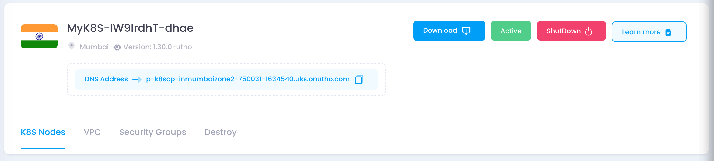
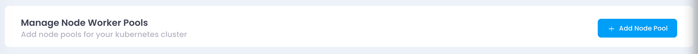
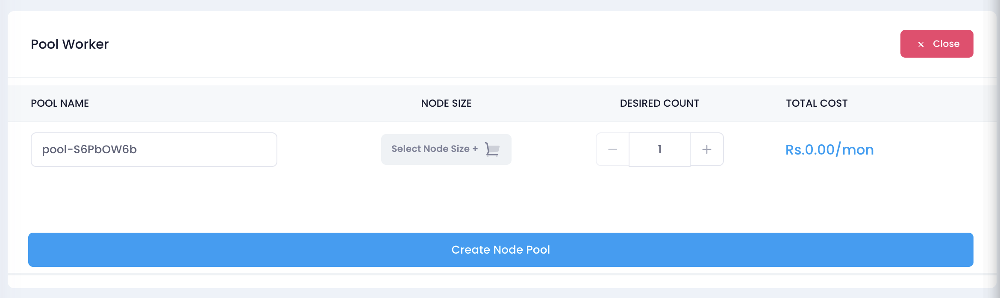

This guide demonstrates how to use the Utho API to add nodepool to the existing Kubernetes cluster and manage it programmatically. The example code snippets are provided in multiple programming languages, including  **cURL** ,  **Python** ,  **JavaScript (Node.js)** ,  **PHP** , and  **Java** .

---

### API Endpoint

 **URL** : `https://api.utho.com/v2/kubernetes/<cluster_id>/nodepool/add`

 **Method** : `POST`

 **Content-Type** : `application/json`

 **Headers:**

* **Authorization:** `Bearer YOUR_BEARER_TOKEN`

Replace `<cluster_id>` with the ID of your existing Kubernetes cluster.

### Request Payload

The payload structure is as follows:

```json
{
  "nodepools": [
    {
      "label": "pool-S6PbOW6b",
      "size": "10215",
      "count": "1",
      "ebs": [
        {
          "disk": "30",
          "type": "nvme"
        }
      ]
    }
  ]
}
```

### Example Code Snippets

#### Using Python (requests library)

```python
import requests
import json

url = "https://api.utho.com/v2/kubernetes/750031/nodepool/add"
headers = {
    "Authorization": "Bearer YOUR_API_KEY",
    "Content-Type": "application/json"
}
data = {
    "nodepools": [
        {
            "label": "pool-S6PbOW6b",
            "size": "10215",
            "count": "1",
            "ebs": [
                {
                    "disk": "30",
                    "type": "nvme"
                }
            ]
        }
    ]
}

response = requests.post(url, headers=headers, data=json.dumps(data))
print(response.json())
```

#### **JavaScript (Node.js with Axios)**

```javascript
const axios = require('axios');

const url = 'https://api.utho.com/v2/kubernetes/750031/nodepool/add';
const headers = {
  'Content-Type': 'application/json',
  'Authorization': 'Bearer <your_api_token>',
};

const payload = {
  nodepools: [
    {
      label: 'pool-S6PbOW6b',
      size: '10215',
      count: '1',
      ebs: [
        { disk: '30', type: 'nvme' },
      ],
    },
  ],
};

axios.post(url, payload, { headers })
  .then(response => {
    console.log('Response:', response.data);
  })
  .catch(error => {
    console.error('Error:', error.response.data || error.message);
  });
```

---

#### **PHP (cURL)**

```php
<?php

$url = 'https://api.utho.com/v2/kubernetes/750031/nodepool/add';
$headers = [
    'Content-Type: application/json',
    'Authorization: Bearer <your_api_token>',
];

$payload = [
    'nodepools' => [
        [
            'label' => 'pool-S6PbOW6b',
            'size' => '10215',
            'count' => '1',
            'ebs' => [
                ['disk' => '30', 'type' => 'nvme'],
            ],
        ],
    ],
];

$ch = curl_init($url);
curl_setopt($ch, CURLOPT_RETURNTRANSFER, true);
curl_setopt($ch, CURLOPT_HTTPHEADER, $headers);
curl_setopt($ch, CURLOPT_POST, true);
curl_setopt($ch, CURLOPT_POSTFIELDS, json_encode($payload));

$response = curl_exec($ch);
curl_close($ch);

if ($response) {
    echo "Response: " . $response;
} else {
    echo "Error: " . curl_error($ch);
}
```

#### **Bash (cURL)**

```bash
#!/bin/bash

url="https://api.utho.com/v2/kubernetes/750031/nodepool/add"
token="<your_api_token>"

payload='{
  "nodepools": [
    {
      "label": "pool-S6PbOW6b",
      "size": "10215",
      "count": "1",
      "ebs": [
        {"disk": "30", "type": "nvme"}
      ]
    }
  ]
}'

response=$(curl -s -X POST "$url" \
  -H "Content-Type: application/json" \
  -H "Authorization: Bearer $token" \
  -d "$payload")

echo "Response: $response"
```

---

## API Responses

### Create Kubernetes Cluster

On success:

```json
{
  "status": "success",
  "message": "Kubernetes Cluster deployment is in process and should be completed in few seconds.",
  "id": 750063
}
```

### Add Node Pool

On success:

```json
{
  "status": "success",
  "message": "New Node Pool added to cluster and a progress started to add nodes to the cluster.",
  "id": "750031"
}
```

---

## Notes

1. Ensure the payload values match your desired cluster configuration.
2. Replace placeholder values like `dcslug`, `vpc`, `nodepools`, and `cluster_id` as per your requirements.
3. Proper error handling should be implemented in your application for production usage.

## Adding a Node Pool to Cluster using Control Panel

#### 1. Navigate to the Cluster Dashboard

1. [Log in](https://console.utho.com/login "https://console.utho.com/login") to your Utho Cloud account.
2. Go to the Kubernetes section.
3. Select the cluster to which you want to **add a node pool.**



#### 2. Open the Node Pool Management Section

1. Scroll down to the **Manage Node Worker Pools** section.
2. Click the **+ Add Node Pool** button.



#### 3. Configure the Node Pool

1. A **Pool Worker** configuration window will appear.
2. The system will generate a default pool name (e.g., `pool-S6PbOW6b`). You can modify it if needed.
3. Select the **Node Size** by clicking the **Select Node Size** button.
4. Adjust the **Desired Count** of nodes using the `+` or `-` buttons.
5. Review the **Total Cost** displayed at the bottom.



#### 4. Create the Node Pool

1. Once all configurations are set, click the **Create Node Pool** button.
2. The system will initiate the creation process.
3. Wait for the process to complete and verify the node pool appears in the cluster's node list.

## Verify if a Node Pool is Added to the Kubernetes Cluster

---

* Go back to the **K8S Nodes** tab.
* Ensure that the newly added node pool is listed and in an active state.

Once you have added a node pool to your cluster, follow these steps to confirm its successful addition:

#### Step 1: Check Available Nodes

Run the following command to list all nodes in the cluster:

```bash
kubectl get nodes -o wide
```

* If the newly added nodes appear in the output, the node pool has been successfully added.
* You can check the **AGE** column to distinguish newly added nodes.

---

#### Step 2: Verify Node Labels

Each node pool may have specific labels. To check if the nodes belong to the new node pool:

```bash
kubectl get nodes --show-labels
```

* Look for labels such as `nodepool=<your-nodepool-name>`.

Alternatively, filter nodes by a specific label:

```bash
kubectl get nodes -l nodepool=<your-nodepool-name>
```

---

#### Step 3: Describe a Node

Pick a node from the new node pool and describe it:

```bash
kubectl describe node <node-name>
```

* This will show details such as node capacity, conditions, and taints.

---

#### Step 4: Check Running Pods on New Nodes

To verify if workloads are scheduled on the new nodes:

```bash
kubectl get pods -o wide
```

* Check the **NODE** column to see if new nodes are hosting pods.

If no pods are scheduled, you can try deploying a test workload targeting the new node pool.

---

#### Step 5: Deploy a Test Pod to New Node Pool (Optional)

If you want to ensure that new nodes are being utilized, create a pod specifically scheduled on the new node pool:

```yaml
apiVersion: v1
kind: Pod
metadata:
  name: test-pod
spec:
  nodeSelector:
    nodepool: <your-nodepool-name>
  containers:
    - name: test-container
      image: nginx
```

Apply it using:

```bash
kubectl apply -f test-pod.yaml
kubectl get pods -o wide
```

If the pod runs successfully on a node from the new node pool, it confirms the addition.

---

#### Step 6: Check Autoscaler (If Enabled)

If your cluster has an autoscaler enabled, ensure that the new node pool is registered correctly:

```bash
kubectl get configmap -n kube-system cluster-autoscaler-status -o yaml
```

Look for the node pool in the status.
