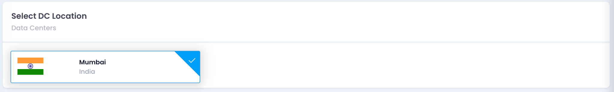

Follow these steps to deploy a Kubernetes cluster on Utho Cloud platform using the Kubernetes deployment page.

---

## How to Create a Kubernetes Cluster using Utho API

This guide demonstrates how to use the Utho API to create a Kubernetes cluster programmatically. The example code snippets are provided in multiple programming languages, including  **cURL** ,  **Python** ,  **JavaScript (Node.js)** ,  **PHP** , and  **Java** .

---

## API Endpoint

 **URL** : `https://api.utho.com/v2/kubernetes/deploy`

 **Method** : `POST`

 **Content-Type** : `application/json`

 **Headers:**

* **Authorization:** `Bearer YOUR_BEARER_TOKEN`

---

## Request Payload

The payload structure is as follows:

```json
{
  "dcslug": "inmumbaizone2",
  "cluster_label": "MyK8S-z2tkradY-wkjp",
  "cluster_version": "1.30.0-utho",
  "nodepools": [
    {
      "label": "pool-Kcpvcjdg",
      "size": "10045",
      "count": "1",
      "maxCount": "1"
    }
  ],
  "vpc": "1c689760-e9cf-48e3-b62d-8128b5e6edd7",
  "subnetRequired": "false",
  "network_type": "public",
  "firewall": "on",
  "cpumodel": "amd"
}
```

---

## Example Code Snippets

### 1. **Using cURL**

```bash
curl -X POST https://api.utho.com/v2/kubernetes/deploy \
-H "Authorization: Bearer YOUR_API_KEY" \
-H "Content-Type: application/json" \
-d '{
  "dcslug": "inmumbaizone2",
  "cluster_label": "MyK8S-z2tkradY-wkjp",
  "cluster_version": "1.30.0-utho",
  "nodepools": [
    {
      "label": "pool-Kcpvcjdg",
      "size": "10045",
      "count": "1",
      "maxCount": "1"
    }
  ],
  "vpc": "1c689760-e9cf-48e3-b62d-8128b5e6edd7",
  "subnetRequired": "false",
  "network_type": "public",
  "firewall": "on",
  "cpumodel": "amd"
}'
```

---

### 2. **Using Python (requests library)**

```python
import requests
import json

url = "https://api.utho.com/v2/kubernetes/deploy"
headers = {
    "Authorization": "Bearer YOUR_API_KEY",
    "Content-Type": "application/json"
}
data = {
    "dcslug": "inmumbaizone2",
    "cluster_label": "MyK8S-z2tkradY-wkjp",
    "cluster_version": "1.30.0-utho",
    "nodepools": [
        {
            "label": "pool-Kcpvcjdg",
            "size": "10045",
            "count": "1",
            "maxCount": "1"
        }
    ],
    "vpc": "1c689760-e9cf-48e3-b62d-8128b5e6edd7",
    "subnetRequired": "false",
    "network_type": "public",
    "firewall": "on",
    "cpumodel": "amd"
}

response = requests.post(url, headers=headers, data=json.dumps(data))
print(response.json())
```

---

### 3. **Using JavaScript (Node.js - Axios)**

```javascript
const axios = require('axios');

const url = 'https://api.utho.com/v2/kubernetes/deploy';
const headers = {
    "Authorization": "Bearer YOUR_API_KEY",
    "Content-Type": "application/json"
};

const data = {
  dcslug: "inmumbaizone2",
  cluster_label: "MyK8S-z2tkradY-wkjp",
  cluster_version: "1.30.0-utho",
  nodepools: [
    {
      label: "pool-Kcpvcjdg",
      size: "10045",
      count: "1",
      maxCount: "1"
    }
  ],
  vpc: "1c689760-e9cf-48e3-b62d-8128b5e6edd7",
  subnetRequired: "false",
  network_type: "public",
  firewall: "on",
  cpumodel: "amd"
};

axios.post(url, data, { headers: headers })
  .then(response => console.log(response.data))
  .catch(error => console.error(error));
```

---

### 4. **Using PHP (cURL)**

```php
<?php

$url = "https://api.utho.com/v2/kubernetes/deploy";
$headers = [
    "Authorization: Bearer YOUR_API_KEY",
    "Content-Type: application/json"
];
$data = [
    "dcslug" => "inmumbaizone2",
    "cluster_label" => "MyK8S-z2tkradY-wkjp",
    "cluster_version" => "1.30.0-utho",
    "nodepools" => [
        [
            "label" => "pool-Kcpvcjdg",
            "size" => "10045",
            "count" => "1",
            "maxCount" => "1"
        ]
    ],
    "vpc" => "1c689760-e9cf-48e3-b62d-8128b5e6edd7",
    "subnetRequired" => "false",
    "network_type" => "public",
    "firewall" => "on",
    "cpumodel" => "amd"
];

$ch = curl_init($url);
curl_setopt($ch, CURLOPT_POST, 1);
curl_setopt($ch, CURLOPT_HTTPHEADER, $headers);
curl_setopt($ch, CURLOPT_POSTFIELDS, json_encode($data));
curl_setopt($ch, CURLOPT_RETURNTRANSFER, true);

$response = curl_exec($ch);
curl_close($ch);

echo $response;
```

---

### 5. **Using Java (HttpURLConnection)**

```java
import java.io.OutputStream;
import java.net.HttpURLConnection;
import java.net.URL;

public class KubernetesCluster {
    public static void main(String[] args) {
        try {
            String url = "https://api.utho.com/v2/kubernetes/deploy";
            String jsonInputString = "{\"dcslug\":\"inmumbaizone2\",\"cluster_label\":\"MyK8S-z2tkradY-wkjp\",\"cluster_version\":\"1.30.0-utho\",\"nodepools\":[{\"label\":\"pool-Kcpvcjdg\",\"size\":\"10045\",\"count\":\"1\",\"maxCount\":\"1\"}],\"vpc\":\"1c689760-e9cf-48e3-b62d-8128b5e6edd7\",\"subnetRequired\":\"false\",\"network_type\":\"public\",\"firewall\":\"on\",\"cpumodel\":\"amd\"}";

            HttpURLConnection conn = (HttpURLConnection) new URL(url).openConnection();
            conn.setRequestMethod("POST");
            connection.setRequestProperty("Content-Type", "application/json", "Authorization", "Bearer YOUR_API_KEY");
            conn.setDoOutput(true);

            try (OutputStream os = conn.getOutputStream()) {
                byte[] input = jsonInputString.getBytes("utf-8");
                os.write(input, 0, input.length);
            }

            int code = conn.getResponseCode();
            System.out.println("Response Code: " + code);
        } catch (Exception e) {
            e.printStackTrace();
        }
    }
}
```

---

## Response

On success, the API returns a response like this:

```json
{
  "status": "success",
  "message": "Kubernetes Cluster deployment is in process and should be completed in few seconds.",
  "id": 750063
}
```

---

## Notes

1. Ensure the payload values match your desired cluster configuration.
2. Replace placeholder values like `dcslug`, `vpc`, and `nodepools` as per your requirements.
3. Proper error handling should be implemented in your application for production usage.

This guide provides a foundation for integrating Utho API into your system.

## Create a Kubernetes Cluster using Control Panel

**1. Select DC Location**

* Choose a **Data Center** location from the dropdown menu.
* Example: Select "Mumbai, India."



---

**2. Select Kubernetes Version**

* Enter a **Cluster Label** to identify your Kubernetes cluster.
* Choose a **Cluster Version** from the dropdown menu.


---

**3. Manage Node Worker Pools**

* Click on **Add Node Pool** to configure worker nodes for the cluster.
* Provide a **Pool Name** for the node pool.
* Select a **Node Size** from the dropdown menu to allocate resources for the nodes.
* Specify the **Desired Count** of nodes in the node pool.
* The **Total Cost** will be calculated automatically based on the configuration.


---

**4. Configure VPC Network**

* Select an existing **VPC Network** or click **Add New VPC** to create a new one.


---

**5. Configure Endpoint Access Info**

* Choose the endpoint access level for the Kubernetes API server:
  * **Public** : Accessible from outside the VPC.
  * **Public and Private** : Accessible from both outside and within the VPC.
  * **Private** : Accessible only within the VPC.


---

**6. Configure Security Group**

* Select a **Security Group** from the available options or click **Add New Security Group** to create a new one.


---

**8. Deploy the Cluster**

* Review the total cost displayed at the bottom.
* Click **Deploy Cluster** to initiate the deployment process.


---

**9. Verify the Cluster Deployment**

Once the Kubernetes cluster deployment reaches 100%, you need to verify that the cluster is running correctly.


#### Steps to verify:

1. **Check Cluster Status**

   Download the Kubeconfig file by clicking the "Download" button in the UI.
2. **Access the Cluster**

   Set the environment variable for the Kubeconfig file and check cluster details:

   ```bash
   export KUBECONFIG=/path/to/your/kubeconfig.yaml
   kubectl cluster-info
   ```
3. **List Nodes**

   Ensure the nodes are correctly added to the cluster:

   ```bash
   kubectl get nodes
   ```
4. **Check Running Pods**

   Verify that all system pods are running:

   ```bash
   kubectl get pods -A
   ```
5. **Deploy a Test Application (Optional)**

   Deploy a simple Nginx pod to test:

   ```bash
   kubectl create deployment nginx --image=nginx
   kubectl get pods
   ```

Once these checks confirm a properly running cluster, the deployment verification is complete. Let me know if you need modifications!
