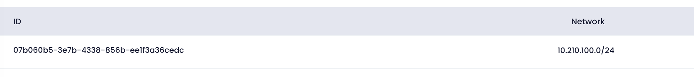

Utho's VPC feature enables users to configure and manage VPC settings for their kubernetes, offering flexibility in network security.

### Vpc configuration

here you can see the VPC details attached with kubernetes.

