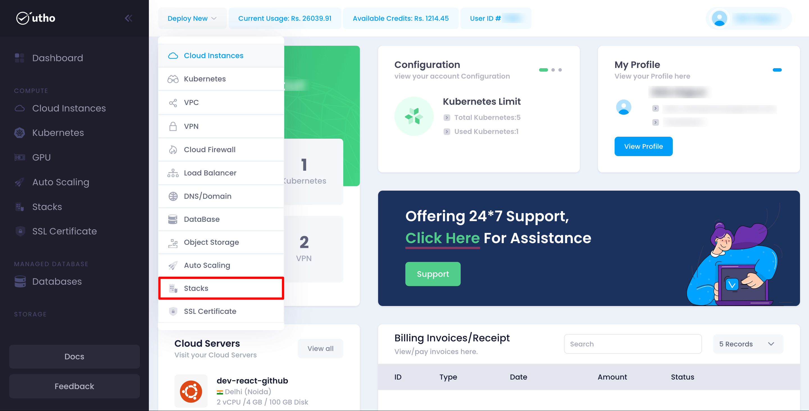
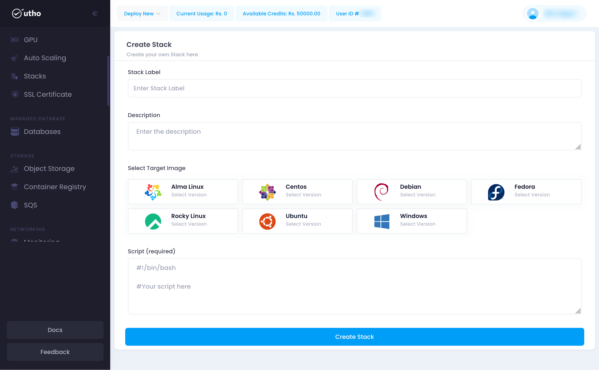
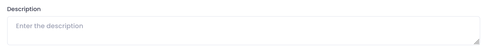
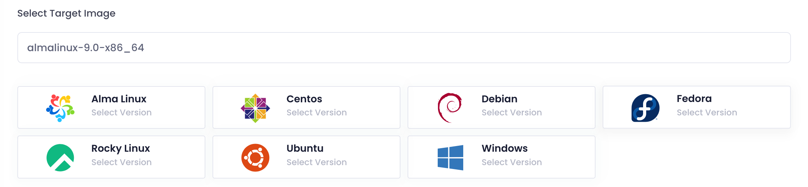
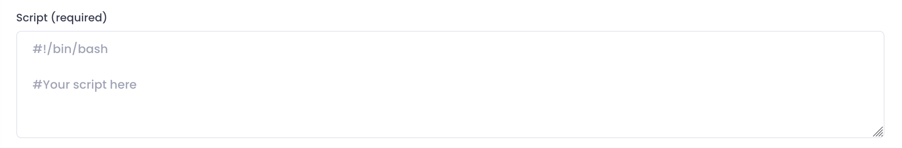
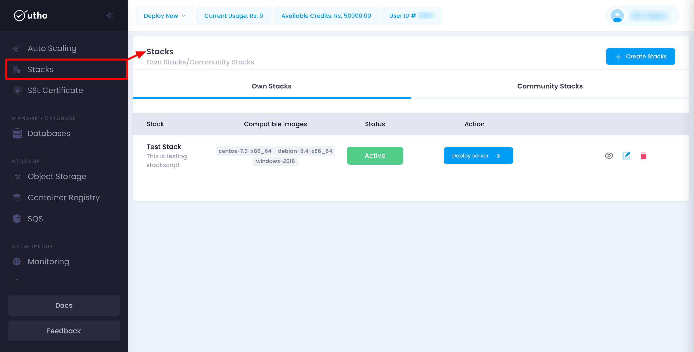

The purpose of this documentation is to provide a quick guide on how to add a stack within our system.

1. Open the Add Stack Page:

   

   - Click on the **Stack** option in the top toolbar menu.
   - When click on that stack button then a stack deplou button.
2. **Fill in Subuser Details:**

   - Enter the following details for the subuser:
     * **Input Label:**

       Enter a unique and descriptive name for your stack.
     * **Input Description:**

       Provide a detailed description of the stack and its intended purpose.
     * **Choose Operating System:**

       Select the desired operating system from the available options. This defines the environment for your stack.
     * **Input Stack Script:**

       Enter the script that will be executed to set up the stack. This can include installation commands, configuration settings, and other necessary steps.
3. **Create the Stack:**

   Click on the **Create Stack** button to save and add the stack to your account.
4. **Verify Stack Addition:**

   Once added, the new stack should appear in the list of stack with their assigned permissions.

This quick start guide will help you efficiently add and manage stack within your organization's account, enabling streamlined collaboration and access control.
