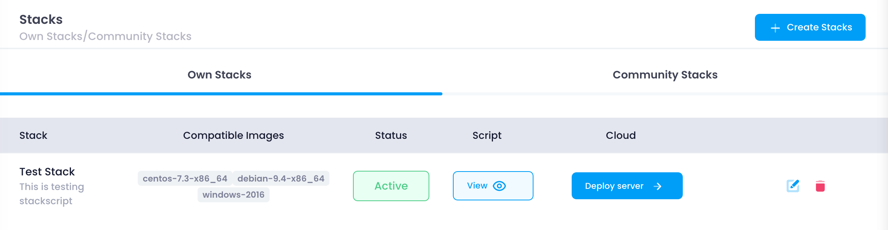
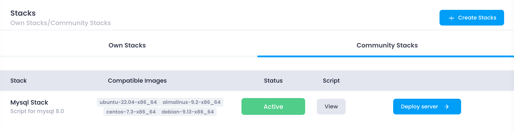

The Stack Dashboard is your central hub for managing all your stacks on the Utho platform. This dashboard is divided into two primary sections: **Own Stack** and  **Community Stack** . Each section provides specific functionalities to help you manage and deploy your stacks efficiently.

#### Own Stack

The **Own Stack** tab displays all the stacks that you have created. This section includes a table with several columns, each providing essential information and actions for managing your stacks:

1. **Stack:**
   * This column shows the name of each stack you have created. It helps you identify and manage different stacks easily.
   * Example: If you have named your stack "WebApp Stack," it will be listed under this column.
2. **Compatible Images:**
   * This column lists the operating systems and environments compatible with the stack. It provides a quick reference to see which images can be used with each stack.
   * Example: "Ubuntu 20.04, CentOS 7, Windows Server 2019."
3. **Status:**
   * This column shows the current status of the stack, such as active or inactive. The status helps you understand if the stack is ready for deployment or if there are any issues.
   * Example: "Active" means the stack is ready to use, while "Inactive" may indicate it needs configuration.
4. **Deploy Cloud:**
   * This button allows you to deploy the stack on a new cloud instance. Clicking this button will take you to the configuration page where you can set up your deployment.
   * Example: Deploying your "WebApp Stack" to create a new cloud instance with all predefined configurations.
5. **View Script:**
   * This option lets you view the stack script. The script contains all the commands and configurations needed to set up the stack.
   * Example: Viewing the installation script for a LAMP stack (Linux, Apache, MySQL, PHP).
6. **Update:**
   * This button enables you to edit the stack’s configurations. You can update the stack script, change compatible images, or modify other settings.
   * Example: Updating the stack script to include new software or configurations.
7. **Delete:**
   * This button removes the stack from your list. Deleting a stack is permanent and cannot be undone.
   * Example: Removing an outdated stack that is no longer needed.

#### Community Stack

The **Community Stack** tab displays stacks shared by other users in the Utho community. These stacks are publicly accessible and can be deployed on your cloud instances. This section is beneficial for finding pre-configured stacks that suit your needs, saving time on configuration.

1. **Exploring Community Stacks:**
   * You can browse through a variety of stacks created by other users. These stacks can range from simple web servers to complex multi-tier applications.
   * Example: Finding a stack configured for a Node.js environment with MongoDB.
2. **Deployment:**
   * Similar to the Own Stack section, you can deploy community stacks on your cloud instances. This allows you to leverage the expertise of other users and deploy tested configurations quickly.
   * Example: Deploying a community stack for a MEAN (MongoDB, Express, Angular, Node.js) application.
3. **Viewing and Customizing Scripts:**
   * Community stacks often come with scripts that you can view and customize. This flexibility allows you to tailor the stack to your specific requirements.
   * Example: Modifying a community stack script to include additional security settings.

---

By utilizing both the **Own Stack** and **Community Stack** tabs, you can efficiently manage and deploy stacks tailored to your needs or benefit from the shared knowledge of the Utho community. This comprehensive approach to stack management ensures you have the right tools and configurations to support your projects effectively.
