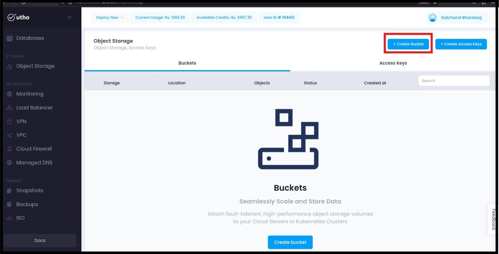
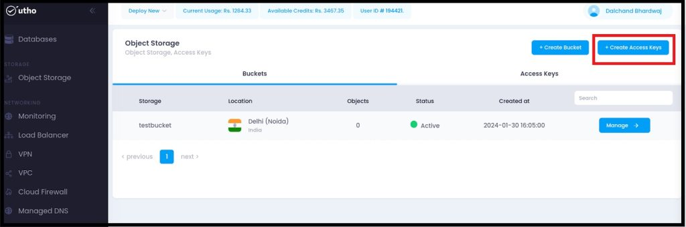
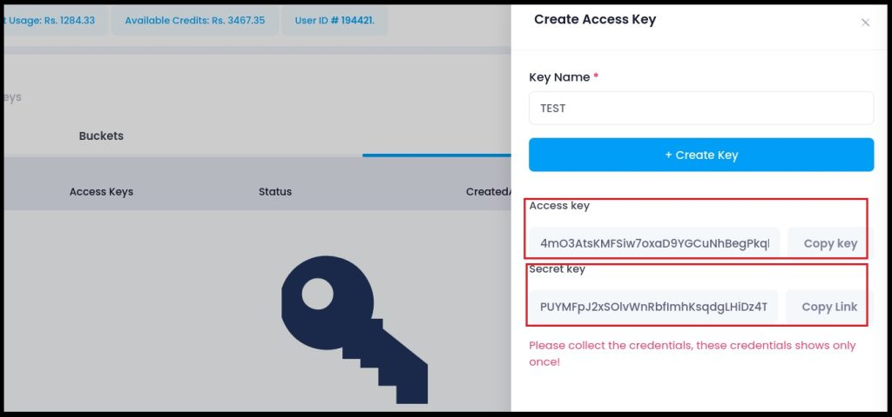
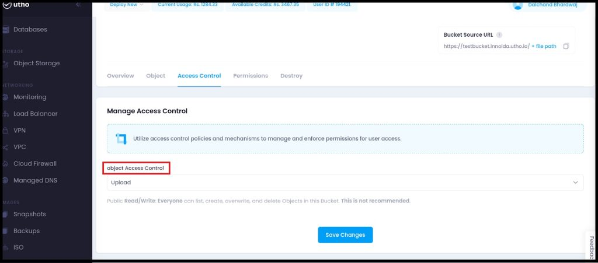
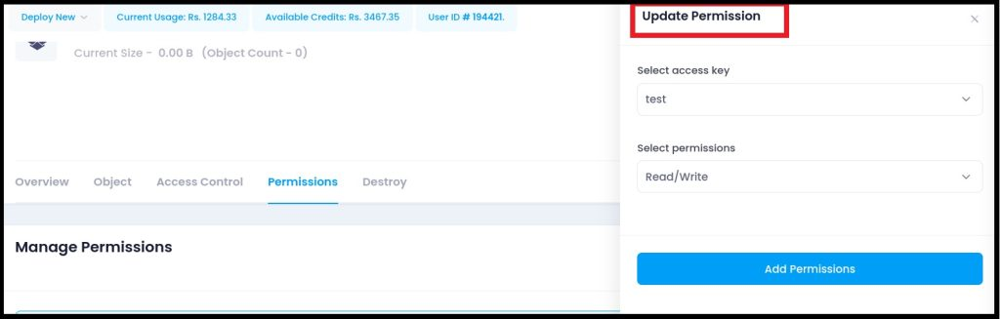
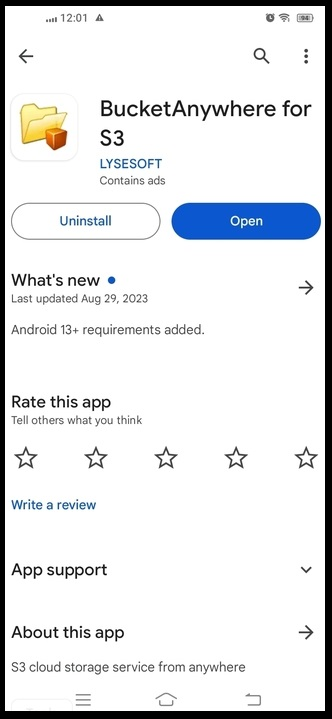

**The ability to seamlessly access and manage data across multiple devices is essential. [Utho's](https://utho.com/) Object Storage provides a dependable solution for storing and organizing your files in the cloud. With the convenience of accessing these files directly from your smartphone, you can stay productive on the go. Follow this guide to link Utho's Object Storage to your phone, making file access and management easy from anywhere.**  

## **Creating a Bucket on Utho's Platform**  

Step 1: Begin by creating a bucket on Utho's platform.  
  
Step 2: Then, proceed to create a bucket and select the "Create Bucket" option.  

During the creation process, choose the Delhi/Noida data center and assign a name to your bucket as per your preference.

Following that, you'll have a bucket at your disposal.  

## **Generating Access Keys for Bucket Access**  

Step 5: Subsequently, return to the object storage section and generate access keys to enable access to your bucket.  

Step 6: Then, provide a name and proceed to create the access key.

After creating the access keys, you will have two keys: a secret key and an access key. Please ensure to copy both keys securely, as they will not be visible again.  

## **Managing Access Control and Permissions**  

Step 3: Then, proceed to click on the "Manage" option.  

Step 4: Next, navigate to the "Access Control" section and grant permissions for uploading as either public or private according to your preference. Choose the "Upload" option accordingly.  

## **Updating Permissions for Object Storage Access  
**

Step 7: Next, navigate to the "Manage" option under Object Storage, select "Permissions," and proceed to update the permissions as necessary.

Step 8: Proceed by selecting the access keys, then update the read/write permissions accordingly.  

## **Installing and Adding “Bucket Anywhere” Application**  

Step 9: Get the "Bucket Anywhere" app on your phone from the Android Play Store.

Step 10: Open the application and proceed to click on the "Add" option.  

## **Configuring Connection Details and Uploading Files**  

Step 11: Fill in the following information: S3 URL - "[https://innoida.utho.io/](https://innoida.utho.io/)", access key, secret access key, and ensure the bucket URL aligns with the details provided when creating Access keys.

Step 12: Click on "Save" and proceed to upload the files and folders. Select the files you from wish to upload, then initiate the upload process  

  

Step: 14  We will connect it to the connect option.  

**Finally, You've successfully connected to your Utho's bucket. Now, you can effortlessly access and manage your files from anywhere. **If you have any questions, feel free to ask. Enjoy easy access to your files wherever you are.****
