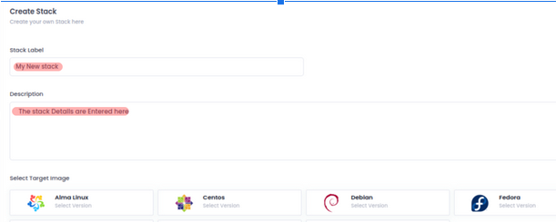
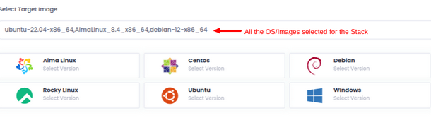
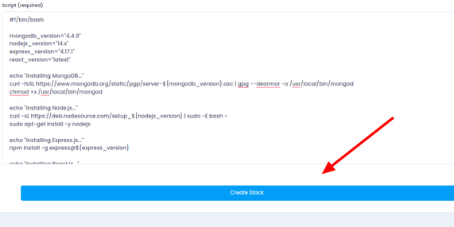

A "stack" is like a digital toolkit that bundles together a collection of software goodies needed to build and run your online creations. Imagine it as a carefully curated package containing an operating system, a web server, a database, and all the special software friends your application loves to hang out with. In the exciting realm of cloud computing, this stack becomes the magic potion that transforms a bunch of code into a fully functional and smoothly running application. So, when you're creating your custom stack, you're basically crafting a personalized universe for your digital brainchild to thrive in – a unique and tailored environment designed just the way you like it!

In order to create your own Stack on the Utho Cloud Dashboard, follow these simple steps:

- Login to your Utho Cloud Dashboard using the [Link](https://console.utho.com/)

- From the Left side menu, navigate to the **Stacks**  option.

- To create your very own custom Stack, click on the **Create Stacks** button which will redirect you to the page to create your own stack using the Utho Dashboard

- Here, you can add a **Stack Label** to identify your stack among multiple others. Similarly, you can use the **description** field to provide details about the stack.

- Additionally, you have the flexibility to choose the operating system that aligns with your preferences for configuring the stack. Feel free to select and add multiple operating systems on which you'd like the stack to operate seamlessly.

- Now, in the script section below, you have the opportunity to incorporate a bash script that outlines all the desired stacks, complete with their version names and specific configurations to be automatically set each time this stack is deployed. Once you've finished customizing your script, save the stack by clicking on Create Stack.

- You will be redirected to the Stacks page, where you can view all the Stacks that you have defined. In order to deploy the stack click on the **Deploy** button as shown in the image below.

- Now, you will be directed to a new window where you can choose the Data Center (DC) Location and switch between the various operating systems you listed during Stack creation. Once you've selected the desired configuration for your cloud instance, click on **Deploy Now.**

Congratulations! An instance with a custom stack has been deployed successfully. You can either set the login credentials at the time of deployment, or you will receive secure credentials after your server has been provisioned, sent to your email ID
