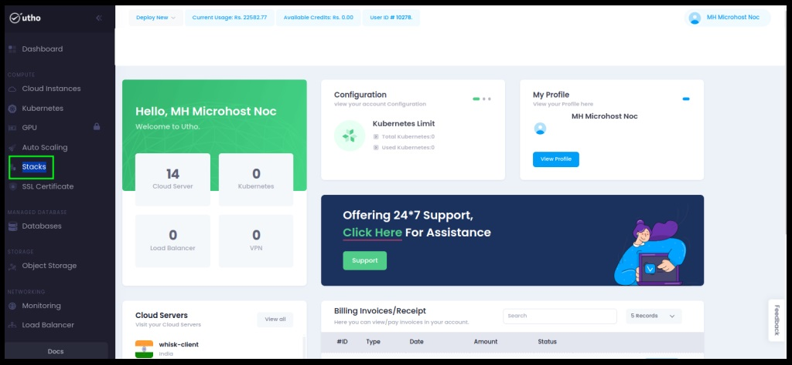
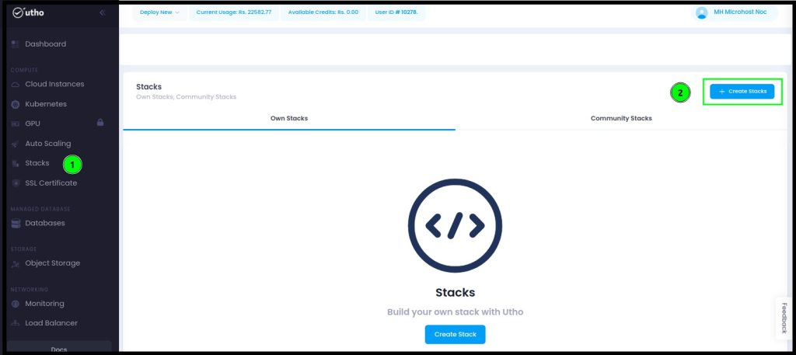
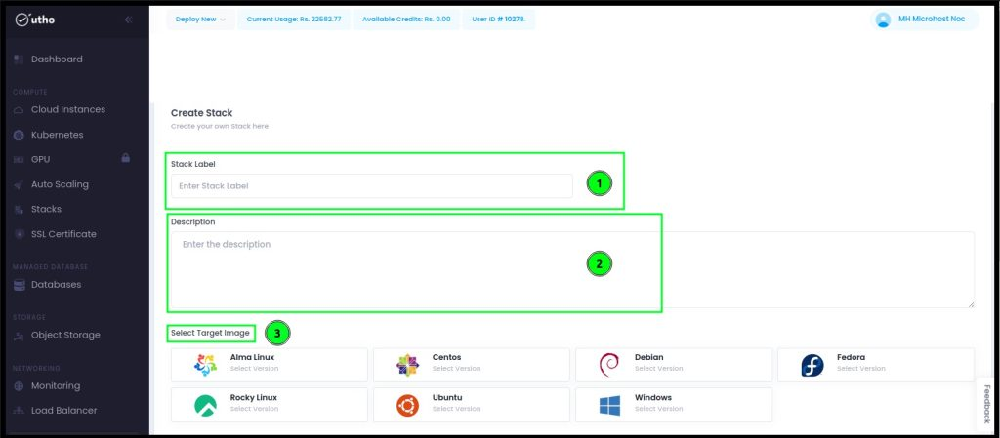
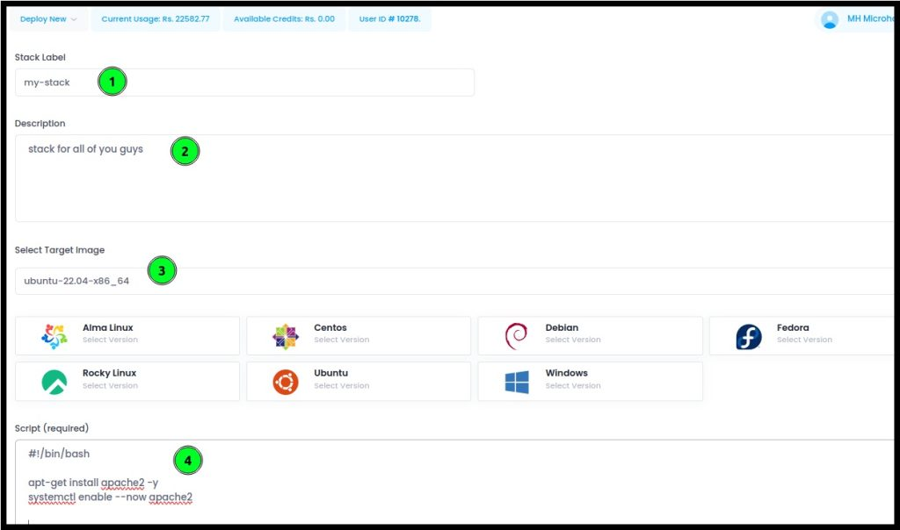
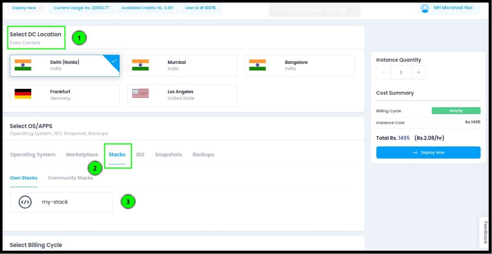

A cloud stack denotes the mix of various [cloud computing](https://utho.com/docs/tutorial/exploring-cloud-computing-scalability-an-in-depth-analysis/) services and elements employed for constructing and overseeing cloud infrastructure. It commonly includes a blend of software, platforms, and infrastructure that collaborate to establish a comprehensive cloud computing environment. Additionally, the term "cloud stack" can also signify a particular software platform designed to facilitate the management and deployment of cloud applications and services.  

**To establish your custom Stack on the Utho cloud dashboard, adhere to the following standardized procedure:**  

## **Step 1:** Access your Utho Cloud Dashboard by logging in through the provided [Link](https://console.utho.com/).  

##   
  
  
  
  
  
  
  
  
  

##   

## **Step 2:** Navigate to the "Stacks" option from the left-side menu.  

## **Step 3:** Initiate the creation of your customized Stack by selecting the "Stacks" button. This action will redirect you to the page within the Utho Dashboard dedicated to crafting your own stack.  

## **Step 4:** Add a Stack Label for identification and utilize the description field to provide details for your stack.  

## **Step 5:** Choose the preferred operating system for configuring the stack. You can add multiple operating systems to ensure seamless operation as per your preferences.  

## **Step 6:** In the script section below, integrate a bash script detailing the desired stacks, including version names and specific configurations. Once customization is complete, save the stack by clicking on 'Create Stack'.  

#!/bin/bash

apt-get install apache2 -y  
systemctl enable --now apache2

## **Step 7:** After saving the stack, you'll be redirected to the Stacks page. To deploy the stack, click the "Deploy" button, as illustrated in the image below.

## **Step 8:** Navigate to a new window where you can choose the Data Center (DC) Location and switch between the listed operating systems. After configuring your preferences for the cloud instance, click 'Deploy Now'.

**Congratulations! Your custom stack instance has been deployed successfully. You can set the login credentials during deployment or expect secure credentials to be sent to your email after server provisioning.**
