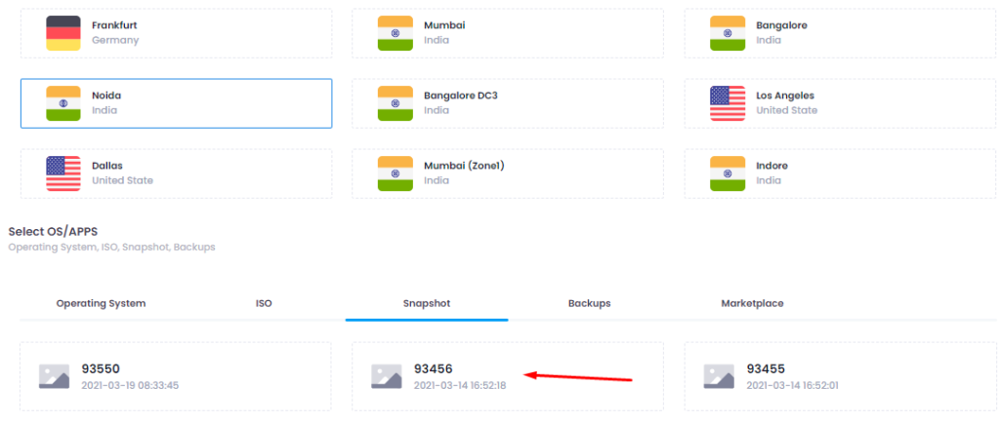

Snapshot is a feature in microhost cloud platform that is an instant "picture" of the file system of your server at a certain time period or we can say Cloning of a server of a particular time frame.

A new server can be deployed with the snapshot. Sometimes, you need to create a server with a copy of another server, We are sharing with you the steps to create a server with snapshot. To know more about snapshot please [Click here](https://utho.com/docs/tutorial/how-to-take-snapshot-of-a-microhost-server/) -

1\. At first, you need to login [Microhost account](https://cloud.microhost.com/)

2\. Click on “Deploy a new cloud server”. First option is to select location, You need to select the same location at which your snapshot server is created. 

Please note that - Both server must be at the same location.

3\. After selecting the size of server click on “deploy Cloud server”.

4\. Server will be created.

Thankyou.
