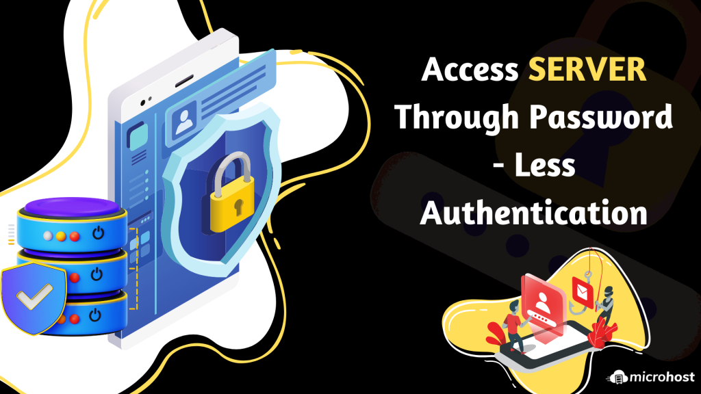
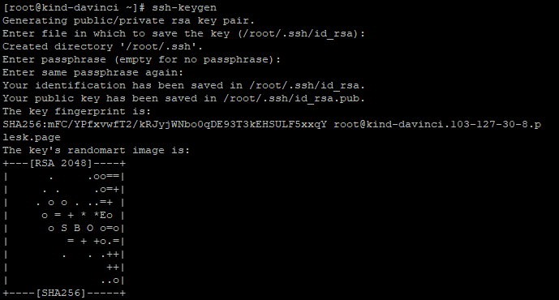
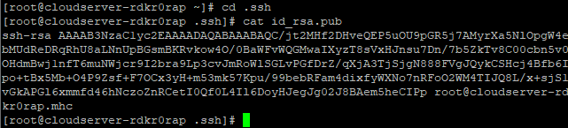
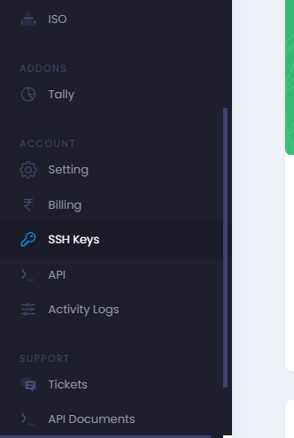
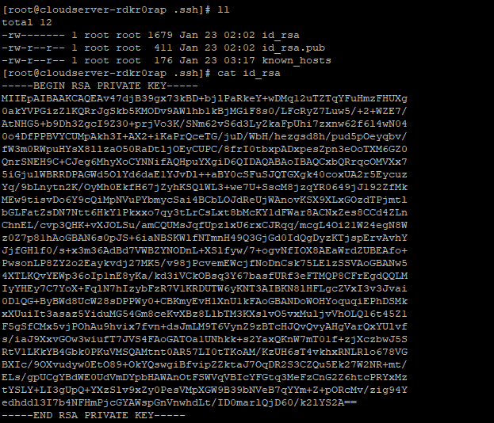
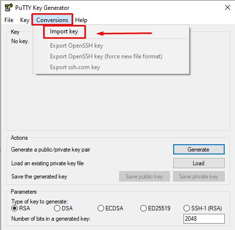
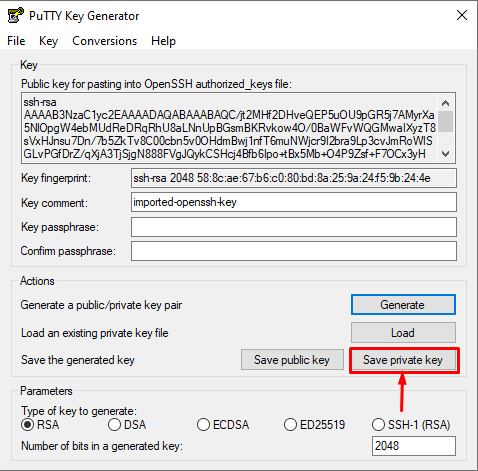
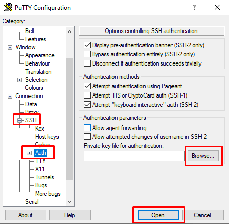
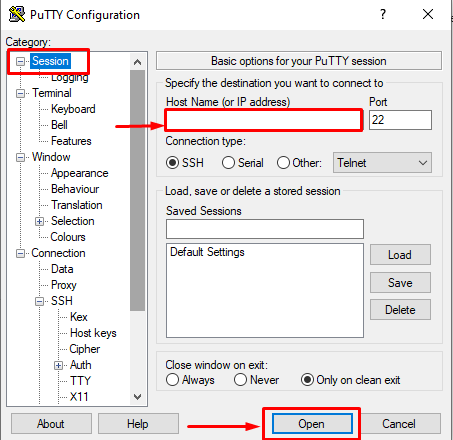
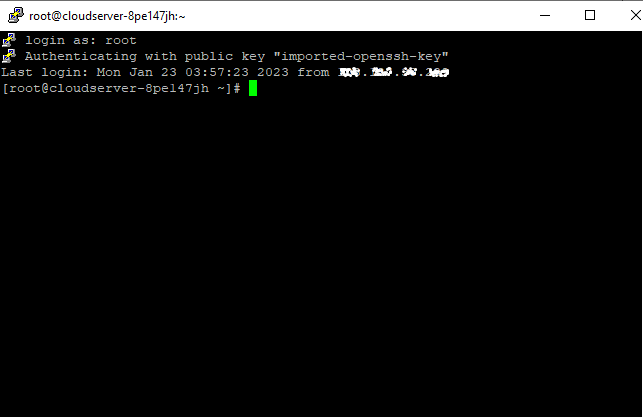

## Introduction

In this article, you will learn how to access a server through password-less authentication.

[SSH](https://en.wikipedia.org/wiki/Secure_Shell), also known as Secure Shell or Secure Socket Shell, is a network [protocol](https://utho.com/docs/tutorial/how-to-troubleshoot-with-nmap-in-centos/) that gives users, particularly system administrators, a secure way to access a computer over an unsecured network. SSH also refers to the suite of utilities that implement the SSH protocol. Secure Shell provides strong password authentication and public key authentication, as well as encrypted data communications between two computers connecting over an open network, such as the internet.

**Step 1. Login server via putty.**


**Step 2. Generate SSH key at your server.**

```
# ssh-keygen
```

**Step 3. Enter file in which to save the key (/root/.ssh/id\_rsa): press enter**

**Step 4. Enter passphrase (empty for no passphrase): press enter**

**Step 5. Enter same passphrase again: press enter**



**Now your SSH key will be created on .ssh folder with name id\_rsa.pub**

**Step 6. Use the following command to go to the.ssh directory.**

```
# cd .ssh
```

**Step 7. Use this command to display the content of a folder.**

```
# cat id_rsa.pub
```

\[caption id="attachment\_9778" align="alignleft" width="641"\] SSH KEY Command Output\[/caption\]

**Step 8. You should now enter your login information for your Microhost account and head over to the SSH key area.**



**Step 9. To import an SSH key, select it and click Import.**


**Step 10. At this point, you need to paste the SSH key shown in step no.7 and specify the name.**


**Step 11. With the SSH key we just imported into our microhost account, we can now set up a new server.**  


**Step 12. Login to your existing server and run the following command:**

```
# ll

```

```
# cat id\_rsa

```



**Step 13. Save this private key in the file "test.ppk" on your desktop. which is shown on the previous screenshot.**

**Step 14. Now open the putty key generator and click on conversions. then select the import key.**



**Step 15. Choose the test.ppk file, open it, and click "Save Private Key." Then press OK.**



**Step 16. Save the file on your desktop with the name test1.ppk**

**Step 17. Open putty Click on "Auth" under the "SSH" option, browse to the "test1.ppk" file, then click "Open."**



**Step 18. Click on sessions. Write down your new server IP, which is deployed in step no. 11. then select open.** 



**Step 19. Write "root" in your terminal and press Enter to see access to your server without a password.**



## Conclusion

Hopefully, you have learned how to access a server through password-less authentication.

Thank You 🙂
