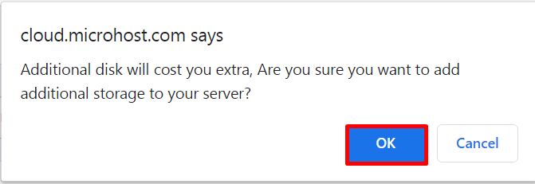
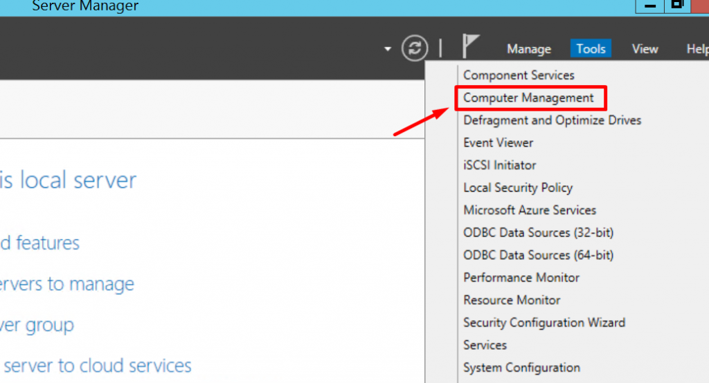
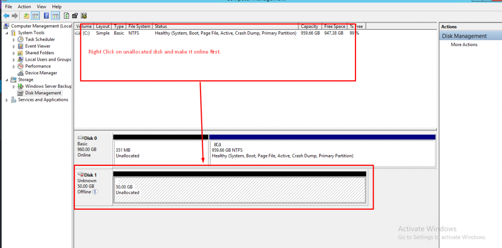
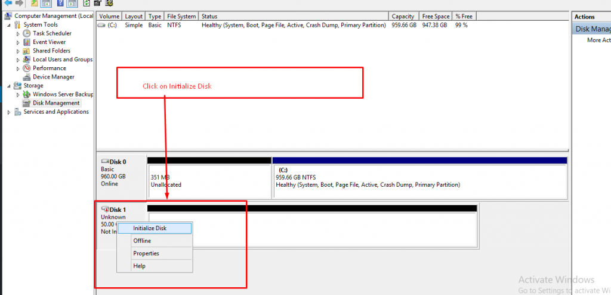
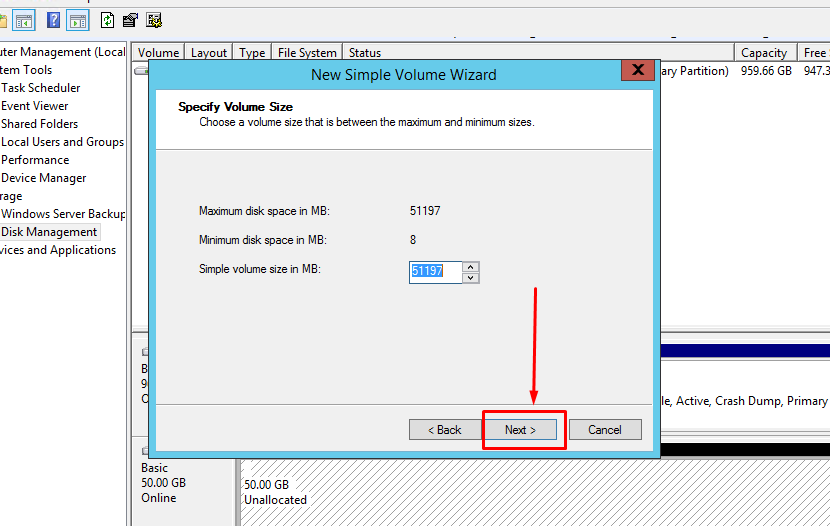
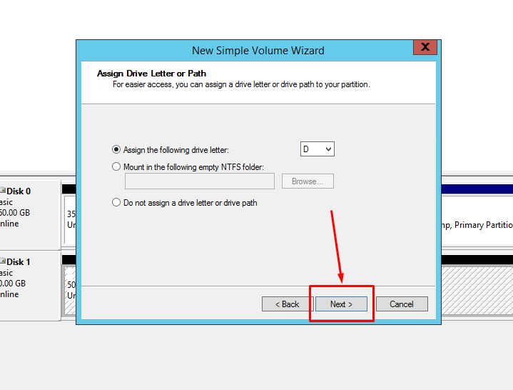
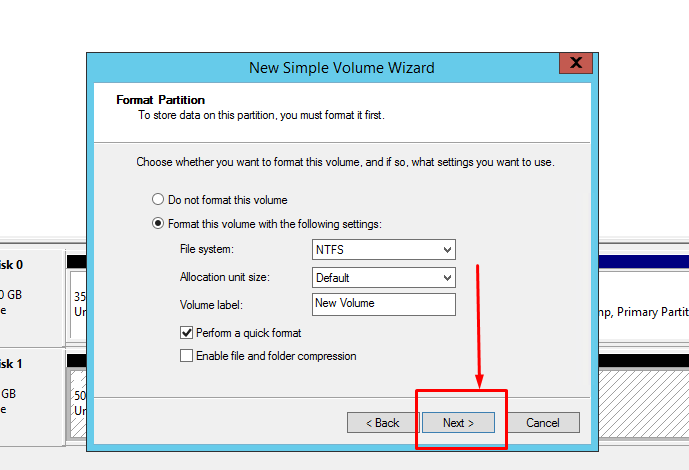
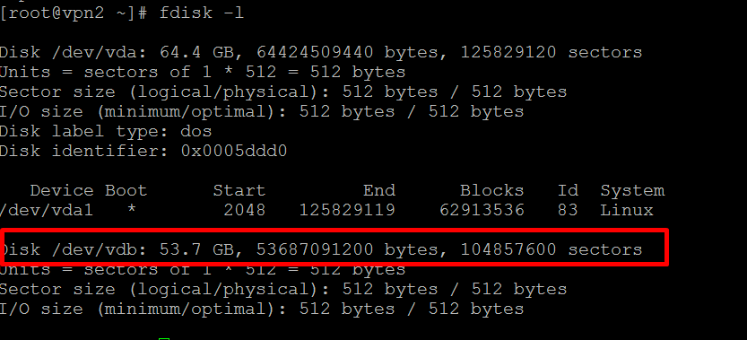

1. Login to [Microhost Cloud Dashboard](https://cloud.microhost.com/)
2. Select the cloud server in which you want to add additional storage and then click on "Actions" button.

<figure>

<figure>

<figcaption>

  

</figcaption>

</figure>

</figure>

3\. When you click on "Manage cloud” option , A window will appear shown in the image below. You need to select “Storage” option and then fill the select size in GB and then click on "Add storage".

4\. Additional storage will be added and you can check added additional storage by following process-

If you are using cloud server with windows operating system then you need to login in the server and click on the server manager -> computer management ->

<figure>

<figure>

<figcaption>

  

</figcaption>

</figure>

</figure>

Click on Disk management.

However, for Windows operating system . We will follow below steps for making additional disk online.

Take the cursor on "ofline" and then right click on that.

While clicking on that, output will be visible as below.

While clicking on online the "disk" it would be online. However, we have to initialize the disk for creating the volume. Have a look on the below screenshot.

After Initializing the disk, we have to format the disk first. Please see the below screenshot for reference.

Select the MBR option and then click on OK. Afterward , we can add a new volume drive by following steps. Click on "New Simple Volume" .

While clicking on "New Simple Volume" a prompt will be shown like below.

Click on Next as per the screenshot . In this section you can select the size of the partition. by default it will take complete space of drive.

Afterward click on next to move further. In this section we can assign the name of new volume. Now click on next.

In this section we have format the disk with NTFS file system and then click on next.

Afterward, we have to finish the process while clicking on finish.

Now , A new drive will be visible in drive section of the system as per the given screenshot.

If you are using cloud server with linux operating system, then you need to follow these below mentioned steps.

fdisk -l :-- To list the all drives.

fdisk /dev/vdb  
mount /dev/vdb1 /new/  
resize2fs /dev/vdb1  
mkfs.ext4 /dev/vdb1  
mount /dev/vdb1 /new/  

**THANK YOU :)**
