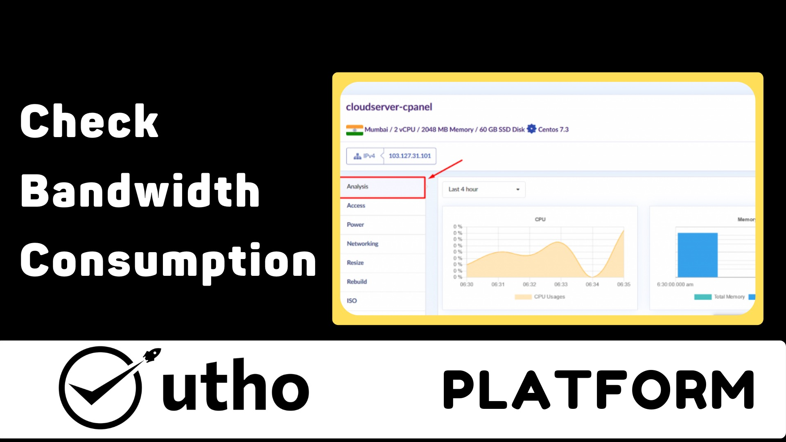
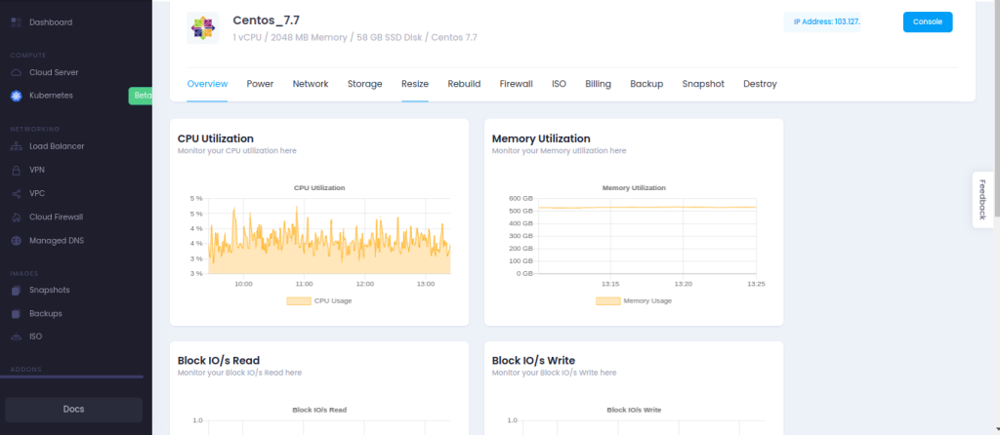
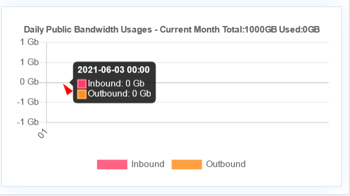
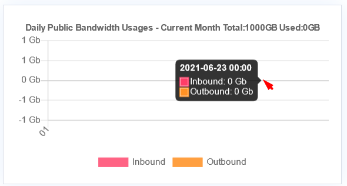

<figure>

<figcaption>

How to check Bandwidth consumption in Microhost panel

</figcaption>

</figure>

Step 1. Login to [Microhost Cloud Dashboard](https://cloud.microhost.com/)

Step 2. Select the cloud server in which you want to add additional storage and then click on “Actions” button.

<figure>

<figcaption>

Manage a cloud

</figcaption>

</figure>

Step 3. When you click on “Manage cloud” option , A window will appear shown in the image below. You need to select the “Analysis” option (By default its already on Analysis) . You can examine your CPU, Memory ,read/write ,traffic and Bandwidth utilization of the server with the help of graph .

<figure>

<figcaption>

Overview of server

</figcaption>

</figure>

Step 4. When you scroll down , the last graph is of “Daily Public Bandwidth usages ” of the current month . You can see your input/output bandwidth day wise by just moving the cursor as shown in the below screenshot.

Thank You!!
