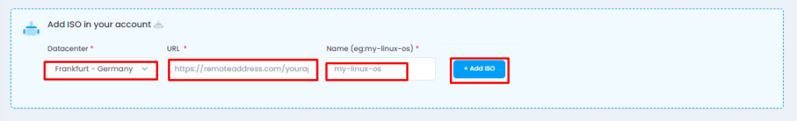
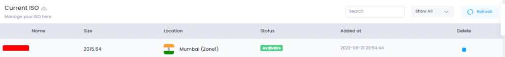
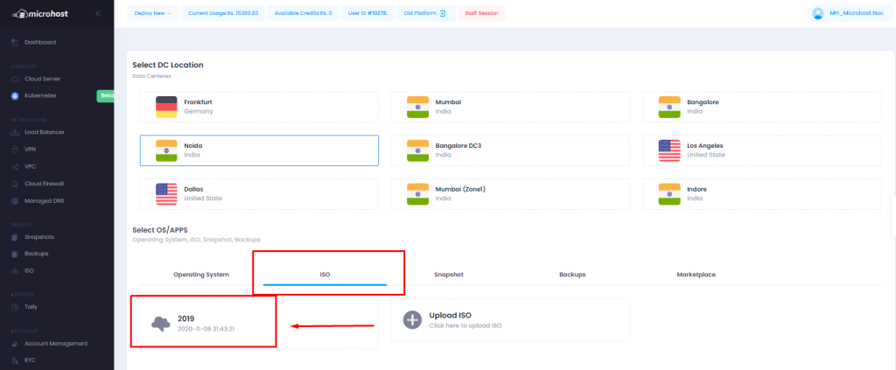
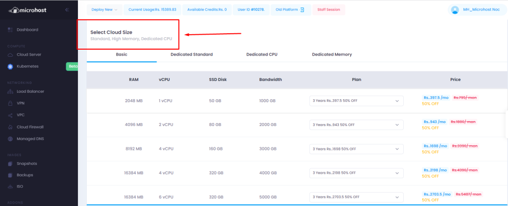
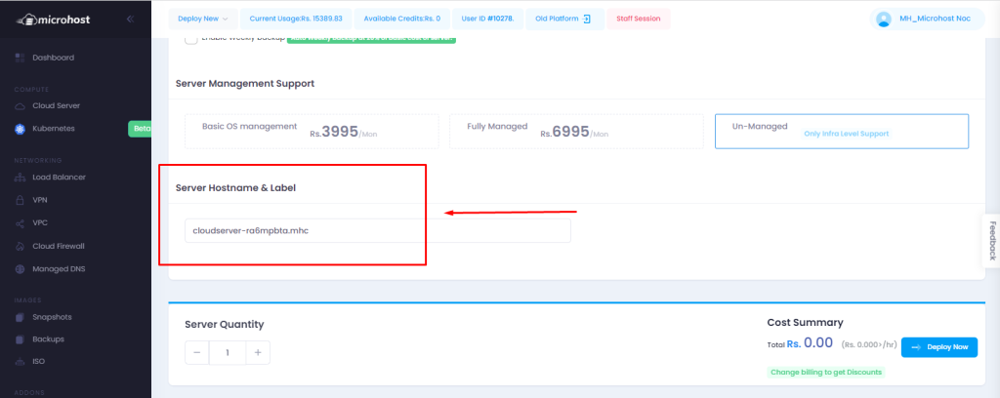
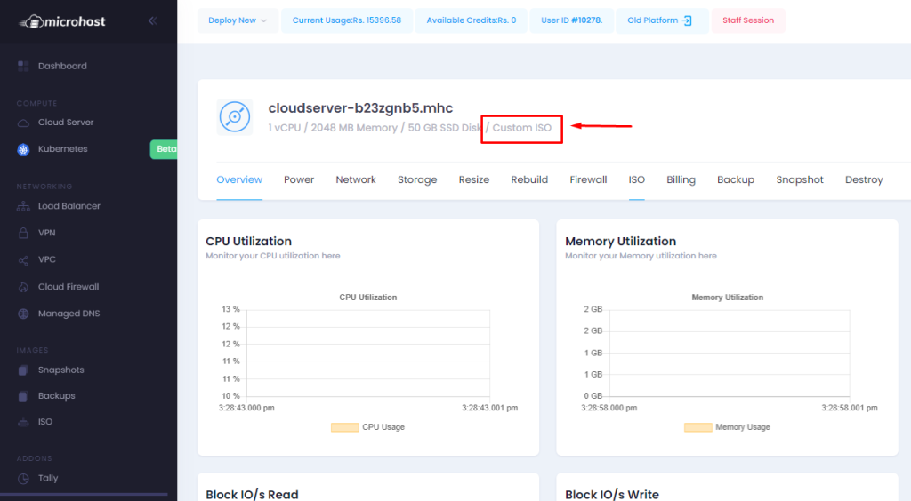
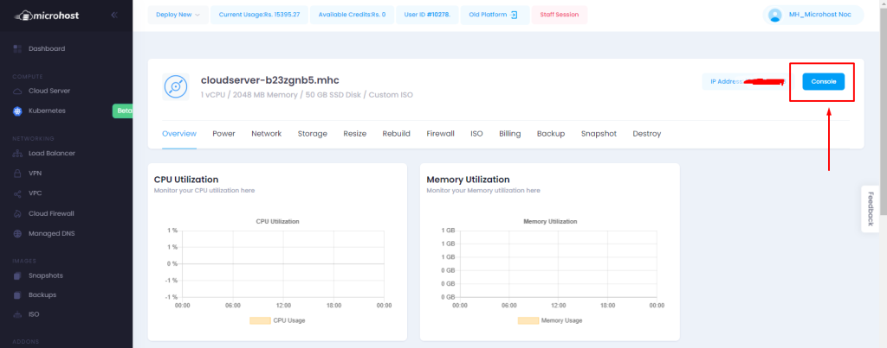
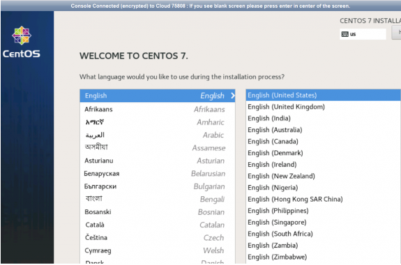

## Introduction

In this article, you will learn how to deploy a cloud server with custom ISO.

**Why do we require custom ISO ?**

To download and use the Custom/specific OS according to the client requirements .

A Custom ISO file is an archive file that contains an identical copy (or image) of data found on an optical disc, like a CD or DVD. For any custom version of OS , you can download ISO file of that OS and Deploy the server with that file.

1\. At first, you need to login [Microhost Cloud Dashboard](https://cloud.microhost.com/)

2\. Select the ISO section in Dashboard.

3\. You can download ISO file here . Choose the data center location , ISO file link and name of the server and click on Add ISO.

**NOTE : DOWNLOAD ISO FILE/LINK FROM THE OFFICIAL WEBSITE ONLY**

ISO is downloaded and available .

4\. Now, create a new server and choose ISO section and that custom ISO file while deploying the cloud server .

**NOTE : DEPLOY THE SERVER ON THE SAME LOCATION AS ISO** 

5\. Select cloud size ,options and enter host name of the server . 

6\. Click on deploy cloud server to deploy and mount the ISO .

7\. Server is in running status now :

8\. Now click on console and install the OS from the Cloud Console .

Console view : Here we are going to install centos 7 , You can install OS as per your requirement.

9\. After the full installation of OS, click on ISO section in the manage cloud and unmount the ISO by clicking on the unmount ISO

Server deployed with Custom ISO .

## Conclusion

Hopefully, now you have learned how to deploy a cloud server with custom ISO.

Also read: [How to take snapshot of a Microhost Cloud Server](https://utho.com/docs/tutorial/how-to-take-snapshot-of-a-microhost-server/)  

Thankyou.
