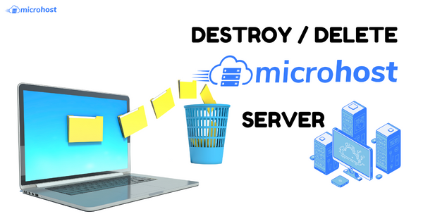
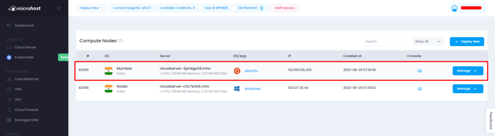
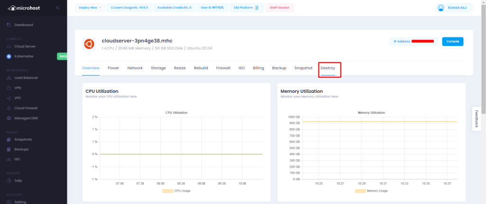

1. At first, you need to login [Microhost Cloud Dashboard](https://cloud.microhost.com/)
2. Select the cloud server that you want to delete.
3. Click on "actions" button, Afterward click on "Destroy Cloud" option as shown in screenshot given below.

## Click on the Cloud Servers option present on the Top left .

## Select the server you want to delete/destroy by clicking on the Manage < Destroy Cloud options .

## Copy and paste the required string as shown below and click on the Destroy Server button.

**NOTE : Please make sure that you have data/backup of the server before destroying your server as it could not be restored again** .

Server has been deleted.

Thankyou.
