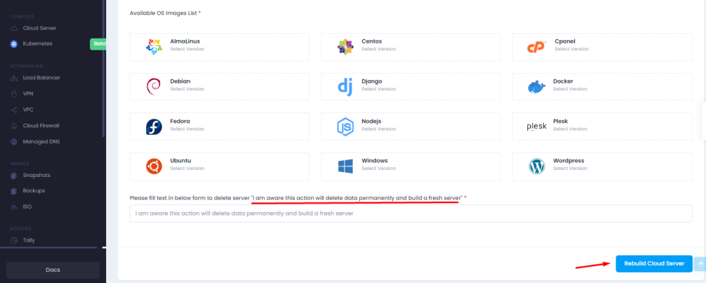

Rebuilding a server means creating a server with clean OS installation and it will erase all current data from server. It is just like formating a server with same configuration.

Please Use this feature only if you want to start your cloud server all with clean OS installation. 

We are sharing with you the steps to rebuild a cloud server -

- Login to [Microhost Cloud Dashboard](https://cloud.microhost.com/)
- Click on cloud server and select the server that you want to rebuild.

- Click on Manage cloud -> Rebuild

- Select the OS in which you want to rebuild
- Fill the text that “ **I want delete my data from current server and build fresh server"**
- Click on “Rebuild cloud server”.

After rebuild server login details will be sent on registered email id.

Thankyou.
