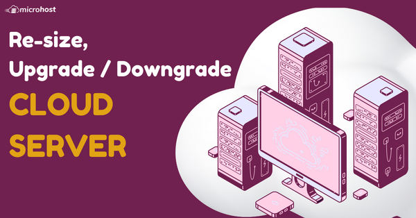
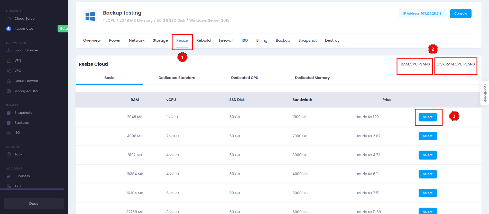
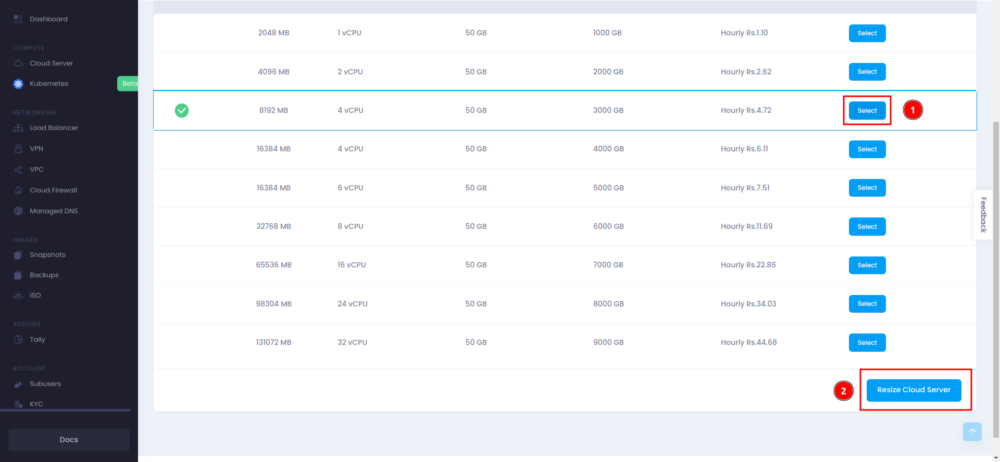

<figure>

<figcaption>

Resize Microhost Cloud instance

</figcaption>

</figure>

1\. First, You need to login [Microhost Cloud Dashboard.](https://cloud.microhost.com/app/login)

2\. Select the cloud server that you want to upgrade.

3\. When you click on “Manage” option , A window will appear shown in the image below. You need to select “Resize”

4\. After getting above image you need to select the desired configuration, Suppose your requirement is 4vCPUs and 8GB RAM, then scroll down and select Resize cloud server.

5\. After Resize, your server will upgraded.

6\. After upgrade the cloud server, you can Downgrade also. First you need to select the configuration and scroll down and click on Resize Cloud server.

7\. After the resize cloud server, your server will be downgraded to your selected plan.

Thank you!!
