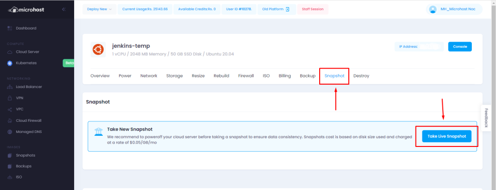

## Introduction

## **In this article, you will learn how to take snapshot of a Microhost Cloud Server.**

Snapshot is a feature in microhost cloud platform that is an instant "picture" of the file system of your server at a certain time period or we can say Cloning of a server of a particular time frame. Snapshot images use minimal storage space.

1\. At first, You need to login to [Microhost Cloud Dashboard](https://cloud.microhost.com/) - 
2\. Select your server of which you want to take snapshot and click on manage cloud.

3\. When you click on “Manage cloud” option , A window will appear shown in the image below. You need to select “snapshot” option and then click on “Take live snapshot”.

4\. A pop-up will appear asking for extra charges for snapshot.

Click OK and snapshot will be created.

5\. You can check created snapshots by this option-

## Conclusion

Hopefully, you have learned take snapshot of a Microhost Cloud Server.

Also read: [How to deploy a cloud server with custom ISO](https://utho.com/docs/tutorial/how-to-deploy-a-cloud-server-with-custom-iso/)

Thankyou.
