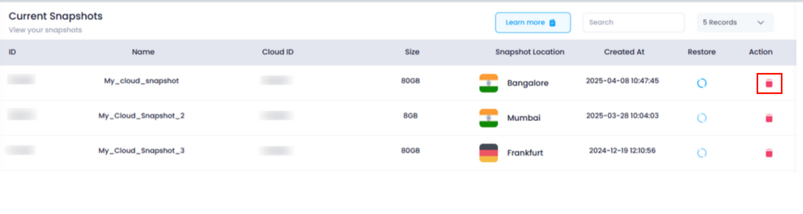
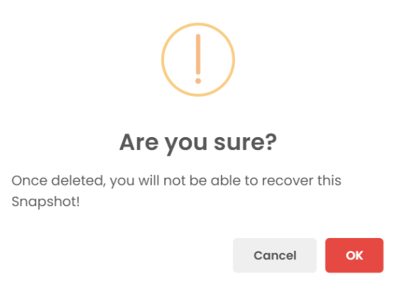
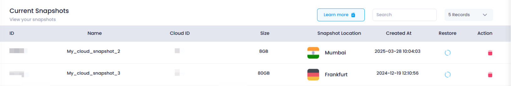

# **How to Delete a Snapshot** 

### **Overview**

Deleting a **snapshot** in Utho Cloud permanently removes the saved state of a cloud server. This action cannot be undone, so it's important to ensure that you no longer need the snapshot before proceeding. The snapshot deletion process is simple and involves confirming your decision to delete through a confirmation popup.

---

### **1. Login to Utho Cloud Platform**

* Visit the Utho Cloud Platform's [Login](https://console.utho.com/login "Login") page.
* Enter your credentials and click  **Login** .
* If you're not registered yet, sign up  **[here](https://console.utho.com/signup "Signup")** .

### **2. Navigate to Snapshot Listing Page**

* Once logged in, go to the **Snapshot Listing Page** or click [here](https://console.utho.com/snapshots "Snapshot Listing Page").
* On this page, you will see a list of all the snapshots created for your cloud servers.

---

### **3. Delete the Snapshot**

* In the Snapshot Listing Page, locate the snapshot you want to delete.
* At the end of the row for that snapshot, click the **Delete** button.

  

---

### **4. Confirm Snapshot Deletion**

* After clicking the **Delete** button, a **confirmation popup** will appear.
* The popup will ask you to confirm the deletion of the snapshot. Deleting a snapshot is permanent and cannot be undone, so make sure you no longer need the snapshot before proceeding.
* Click **OK** in the confirmation popup to confirm the deletion.

  

---

### **5. Verify Snapshot Deletion**

* Once confirmed, the snapshot will be permanently deleted from the system.
* The snapshot will no longer appear in your  **Snapshot Listing Page** .

  
* Deleting the snapshot does not affect the cloud server itself, only the snapshot data will be removed.

---

### **Conclusion**

Deleting a snapshot in Utho Cloud is a straightforward process that ensures your snapshots are properly managed. By following these steps, you can remove unnecessary or outdated snapshots to maintain a clean and organized cloud environment. Just be cautious, as once deleted, the snapshot cannot be restored.
