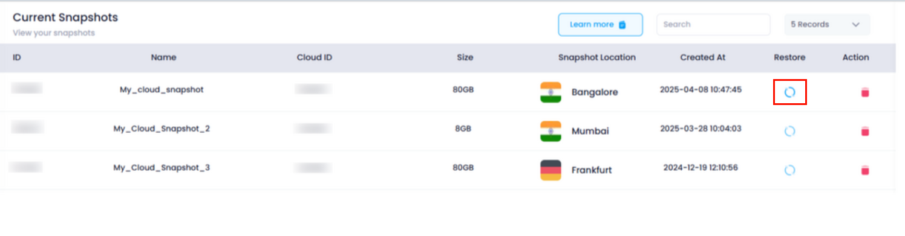
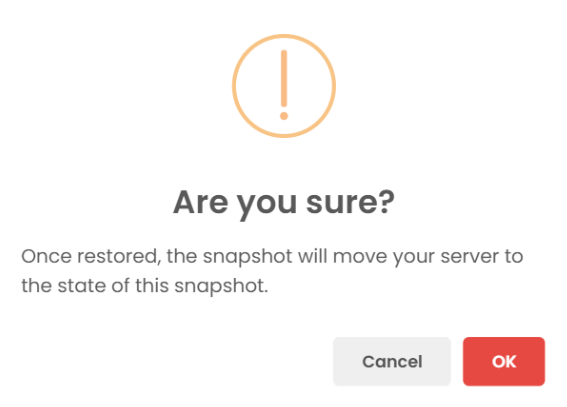

# **How to Restore a Snapshot** 

### **Overview**

Restoring a **snapshot** in Utho Cloud allows you to revert a cloud server to a previous state as captured by a snapshot. This feature is useful when you want to undo changes, recover from a failure, or revert to a stable configuration. Restoring a snapshot will replace the current state of your cloud server with the exact state it was in when the snapshot was taken.

---

### **1. Login to Utho Cloud Platform**

* Visit the Utho Cloud Platform's [Login](https://console.utho.com/login "Login") page.
* Enter your credentials and click  **Login** .
* If you are not registered yet, sign up  **[here](https://console.utho.com/signup "Signup")** .

### **2. Navigate to Snapshot Listing Page**

* Once logged in, go to the **Snapshot Listing Page** or click [here](https://console.utho.com/snapshot "Snapshot Listing Page").
* On this page, you will see a list of all the snapshots created for your cloud servers.

---

### **3. Initiate Snapshot Restoration**

* In the Snapshot Listing Page, locate the snapshot you want to restore.
* Click the **Restore** button next to the desired snapshot.

  

---

### **4. Confirm Snapshot Restoration**

* After clicking the **Restore** button, a **confirmation popup** will appear, warning you about the consequences of restoring the snapshot.
  **Important:** When you restore a snapshot, the **current state** of your cloud server will be overwritten with the state of the server when the snapshot was taken. All changes made after the snapshot was created will be lost.
* Click **OK** in the confirmation popup to confirm the restoration process.

  

---

### **5. Snapshot Restoration Process**

* Once you confirm, the snapshot restoration process will begin. During the restoration:
  * Your cloud server will be reverted to the exact state it was in at the time the snapshot was taken.
  * Any data, configurations, or files created after the snapshot will be lost.
  * The server will undergo a restart or reconfiguration as necessary to apply the snapshot.
* You will be notified with a success message once the restoration is completed.

---

### **What Happens When You Restore a Snapshot**

Restoring a snapshot will replace the current server state with the one stored in the snapshot. This means:

* Any changes, configurations, or data added after the snapshot was taken will be lost.
* The server will be returned to the exact state it was in when the snapshot was created, including installed applications, settings, and files.
* It’s recommended to backup any critical data before restoring a snapshot if you wish to preserve recent changes.

---

### **Conclusion**

Restoring a snapshot in Utho Cloud is a straightforward process that allows you to revert your cloud server to a known, stable state. By following these steps, you can ensure that your server is returned to a desired configuration, especially in cases of system failure or errors. Just be cautious, as restoring a snapshot will overwrite any changes made after the snapshot’s creation.
