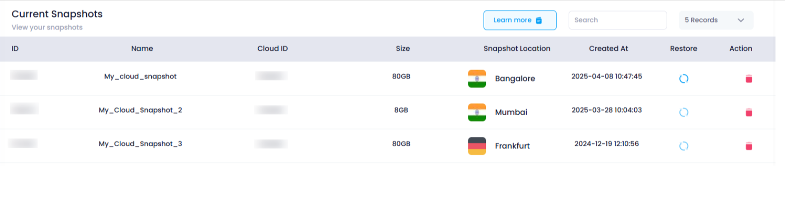

# **How to View Snapshots**

### **Overview**

Viewing **snapshots** in Utho Cloud provides you with a comprehensive overview of all the snapshots created for your cloud servers. This feature allows you to see key details about each snapshot, such as its ID, size, location, and creation time. The snapshot listing page is a centralized hub where you can manage your snapshots, restore servers to a previous state, or delete snapshots you no longer need.

---

### **1. Login to Utho Cloud Platform**

* Visit the Utho Cloud Platform's [Login](https://console.utho.com/login "Login") page.
* Enter your credentials and click  **Login** .
* If you are not registered yet, sign up  **[here](https://console.utho.com/signup "Signup")** .

### **2. Navigate to Snapshot Listing Page**

* Once logged in, go to the **Snapshot Listing Page** or click [here](https://console.utho.com/snapshots "Snapshot Listing Page").
* On this page, you will see a list of all the snapshots created for your cloud servers.

---

### **3. View Snapshot Information**

In the Snapshot Listing Page, you will find a table with the following details for each snapshot:

#### 1. **ID**

* The **ID** column shows the unique identifier for each snapshot. This helps you reference and manage each snapshot efficiently.

#### 2. **Name**

* The **Name** column displays the name of the snapshot. This is the label you assigned to the snapshot when it was created, helping you identify it easily.

#### 3. **Cloud ID**

* The **Cloud ID** column shows the ID of the cloud server associated with the snapshot. This tells you which server the snapshot is related to.

#### 4. **Size**

* The **Size** column indicates the total storage size of the snapshot. This helps you understand how much space the snapshot is using.

#### 5. **Snapshot Location**

* The **Snapshot Location** column shows the data center location where the snapshot is stored. This helps you track the geographical location of your backups.

#### 6. **Created At**

* The **Created At** column shows the exact **date and time** when the snapshot was created. This helps you track the snapshot's creation and monitor its age.

#### 7. **Restore**

* The **Restore** button allows you to restore your cloud server to the state it was in when the snapshot was taken. Clicking this will initiate the restoration process for the selected snapshot.

#### 8. **Action**

* The **Action** column contains a **Delete** icon for each snapshot.
  * Clicking the **Delete** icon will open a confirmation popup where you can confirm the deletion of the snapshot.

---

### **Conclusion**

The Snapshot Listing Page in Utho Cloud allows you to easily view and manage all your snapshots. By accessing this page, you can quickly gather important details about your snapshots, restore a cloud server to a previous state, or delete unnecessary snapshots. This functionality ensures that you can effectively manage backups and maintain the flexibility to revert your servers to a stable and secure configuration whenever needed.
