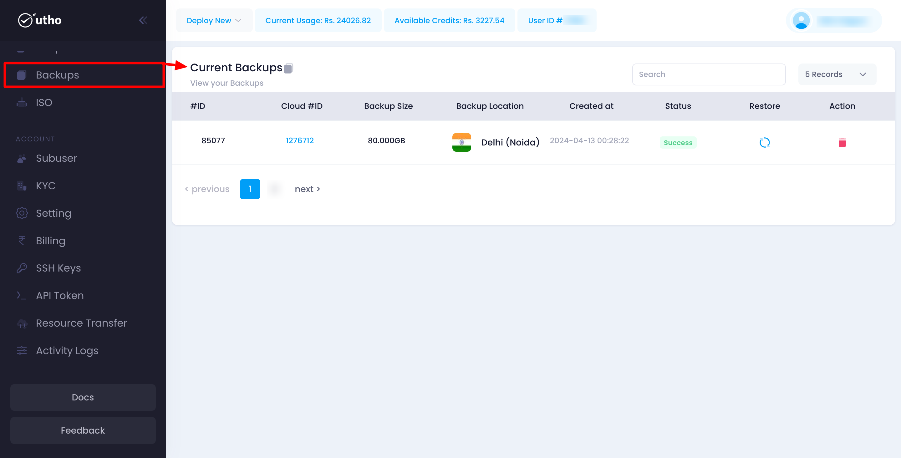

Utho's Backup Management feature allows users to view and manage backups of their server instances. This guide provides detailed instructions on how to access and utilize the backup management features within the Utho platform.

### Navigating the Backup Management Page

The Backup Management page displays a list of all backups associated with your account's server instances. This helps you keep track of your backups and ensures they are readily available for restoration when needed.

1. **Accessing Backup Management:**

   * Navigate to your account settings.
   * Click on the **Backups** tab to view the list of backups.

### Viewing Backups

On the Backup Management page, you will see a table listing all the backups associated with your account's server instances. This table includes:

* **ID:** The unique identifier for the backup.
* **Cloud ID:** The unique identifier for the associated cloud instance.
* **Backup Size:** The size of the backup file.
* **Backup Location:** The location where the backup is stored.
* **Created At:** The date and time the backup was created.
* **Status:** The current status of the backup.
* **Restore Button:** Allows you to restore the specific backup.
* **Action Button:** Allows you to perform additional actions such as deleting the backup.

### Managing Backups

#### Restoring a Backup

To restore a backup, follow these steps:

1. **Identify the Backup:**
   * Review the list of backups in the table.
   * Identify the backup you want to restore by its ID, Cloud ID, and creation date.
2. **Restore the Backup:**
   * Click the **Restore** button next to the backup entry.
   * Confirm the restoration when prompted. This will initiate the process to restore your server instance from the selected backup.

#### Deleting a Backup

If a backup is no longer needed or you want to free up storage space, you can delete it:

1. **Identify the Backup:**
   * Review the list of backups in the table.
   * Identify the backup you want to delete by its ID, Cloud ID, and backup size.
2. **Delete the Backup:**
   * Click the **Action** button next to the backup entry.
   * Select the **Delete** option.
   * Confirm the deletion when prompted. This will immediately remove the backup from your account and storage location.

### Ensuring Backup Management Efficiency

Managing your backups carefully is crucial for maintaining the safety and integrity of your server data. Follow these best practices:

1. **Regularly Schedule Backups:**
   * Ensure you have a regular backup schedule to keep your data safe.
2. **Use Descriptive Names:**
   * Assign descriptive names or identifiers to your cloud instances to easily associate backups with their respective instances.
3. **Monitor Backup Sizes:**
   * Regularly review the size of your backups to manage storage efficiently.
4. **Review Backup Status:**
   * Periodically check the status of your backups to ensure they are completed successfully.

### Troubleshooting

#### Common Issues

* **Backup Not Created:**
  * Ensure all required fields are filled out correctly and the cloud instance is available before initiating a backup.
* **Cannot Restore Backup:**
  * Ensure you have the necessary permissions to restore the backup. Contact support if the issue persists.
* **Cannot Delete Backup:**
  * Ensure you have the necessary permissions to delete the backup. Contact support if the issue persists.

### Support

If you need further assistance with managing backups or encounter any issues, contact Utho support through the support ticket system or via email at [support@utho.com]().
