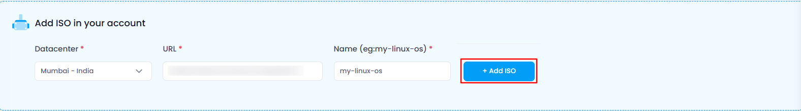
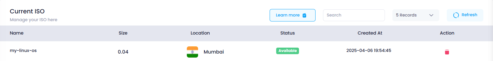

# **How to Add ISO**

## **Overview**

Adding an ISO file to your Utho Cloud account allows you to deploy custom installations seamlessly. The process involves selecting the appropriate data center, entering the ISO URL, and assigning a name for the ISO. Once added, you can use the ISO for provisioning virtual machines or configuring servers.

## **Login or Sign Up**

1. Visit the **Utho Cloud Platform** [login](https://console.utho.com/login) page.
2. Enter your credentials and click  **Login** .
3. If you’re not registered, sign up [here](https://console.utho.com/signup).

## **Steps to Add ISO**

### **1. Navigate to the ISO Listing Page**

* After logging in, go to the  **ISO Listing Page** .
* You can access this page by clicking on **ISOs** in the sidebar or directly visiting [this link](https://console.utho.com/iso "ISO Listing Page").

### **2. Add a New ISO**

* At the top of the page, you will see a section titled  **"Add ISO in Your Account"** .
* Below this section, there is a list of all the ISOs that have been added to your account till now.

### **3. Fill Out the ISO Details**

The following fields are required to add an ISO:

* **Datacenter** :
  * This is a dropdown menu where you select the data center (DC) in which your ISO will be stored.
  * It determines where the ISO file will physically reside. A closer data center location can result in better performance and quicker access when deploying virtual machines or servers using the ISO.
* **URL** :
  * This field requires you to provide the **URL** of the ISO file you want to upload.
  * It points to the location where the ISO file is hosted. The system uses this URL to fetch the ISO file from the source location. This could be a cloud storage service, an external server, or any web-accessible storage system. The URL ensures that the file is retrieved correctly and stored in your Utho Cloud account.
* **Name** :
  * This is a text field where you specify a name for the ISO file.
  * It helps to indentify ISO file in the system. By providing a unique and meaningful name, you can easily search, manage, and organize multiple ISOs. For example, if you’re uploading an ISO for an operating system installation, you could name it something like "Ubuntu-20.04" for easy identification later.

### **4. Add the ISO**

* After filling out the necessary information, click the **Add ISO** button located next to the inputs.
* The system will begin processing your request.
* A success toast notification will appear once the ISO is successfully added, indicating that the download is in progress.

  

### **5. Verify the ISO Has Been Added**

* To check if your ISO has been successfully added, scroll down to the list of **Added ISOs** below.
* The list will show the following details for each ISO:
  * **Name** : The name you assigned to the ISO.
  * **Size** : The size of the uploaded ISO file.
  * **Location** : The data center location where the ISO is stored.
  * **Status** : The current status of the ISO (either the percentage downloaded or marked as Available).
  * **Action** : A delete icon next to each ISO allows you to delete the ISO if needed.
    

---

This guide will help you efficiently add and manage ISO files in your Utho Cloud account. Happy cloud computing! 🚀
