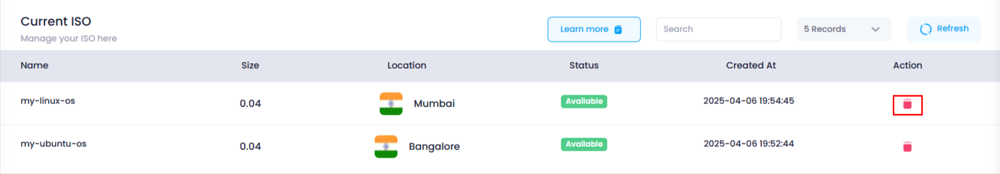
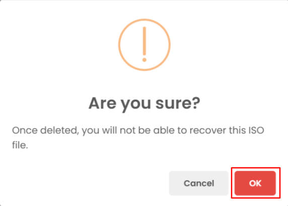
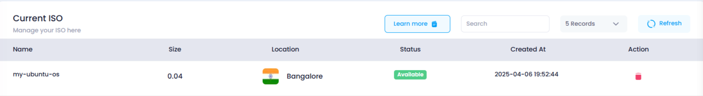

# **How to Delete an Added ISO**

## **Overview**

The **Delete ISO** feature allows you to remove an ISO file from your Utho Cloud account. This ensures that you can keep your account clean and organized by removing ISO files that are no longer needed. Once deleted, the ISO cannot be recovered unless re-uploaded.

## **Login or Sign Up**

1. Visit the **Utho Cloud Platform** [login](https://console.utho.com/login) page.
2. Enter your credentials and click  **Login** .
3. If you're not registered, sign up [here](https://console.utho.com/signup).

## **Steps to Delete an Added ISO**

1. **Navigate to the ISO Listing Page**
   * Once logged in, go to the **ISO Listing Page** by selecting **ISO** from the sidebar or by clicking [here](https://console.utho.com/iso "ISO Listing Page").
2. **Find the ISO to Delete**
   * In the list of uploaded ISOs, find the ISO file that you want to delete. You can identify it by its  **Name** ,  **Size** , and **Location** information.
3. **Click the Delete Icon**
   * At the end of the ISO entry, you’ll see a **Delete icon** (trash can icon). Click on this icon to initiate the deletion process.

     
4. **Confirm Deletion**
   * A modal window will appear asking you to confirm that you want to delete the ISO.
   * Click **OK** in the modal to confirm the deletion. If you change your mind, click **Cancel** to abort the process.

     
5. **Verify the Deletion**
   * Once the ISO has been deleted, it will no longer appear in the  **ISO Listing Page** .
   * To verify, you can check the updated list of ISOs. The deleted ISO will be removed from the list, confirming that the deletion was successful.
     
