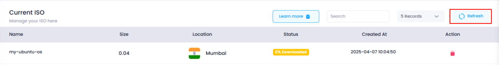
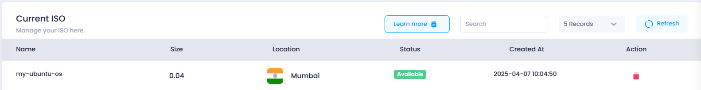

# **How to Refresh ISO List**

## **Overview**

The **Refresh ISO List** feature allows users to update the current status of their ISO files. If any ISOs are still downloading, clicking the "Refresh" button will check their download progress. It will update the status, such as the download percentage or change the status to "Active" once the download is complete. This ensures users have the most up-to-date information on their ISO files.

## **Login or Sign Up**

1. Visit the **Utho Cloud Platform** [login](https://console.utho.com/login) page.
2. Enter your credentials and click  **Login** .
3. If you’re not registered, sign up [here](https://console.utho.com/signup).

## **Steps to Refresh ISO List**

1. **Navigate to the ISO Listing Page**
   * After logging in, navigate to the  **ISO Listing Page** , where you can see all the ISOs that have been added to your account. You can go to the listing page by clicking [here](https://console.utho.com "ISO Listing Page").
2. **Locate the Refresh Button**
   * On the top-right corner of the ISO list, find the **"Refresh"** button. This button allows you to refresh the status of all ISO files listed below.
3. **Click the Refresh Button**
   * Click the **"Refresh"** button. This will trigger the system to fetch the latest status for each ISO file.

     
4. **View Updated Information**
   * After the refresh, the ISO list will be updated with the latest details. If the ISO is still downloading, the **download percentage** will be updated. If the download is complete, the **status** will change from a percentage to "Active."
5. **Verify the Update**
   * Scroll through the updated ISO list and check if the status of any ISO files has changed. You can see whether the percentage has increased or if the ISO status is now "Active."

     
