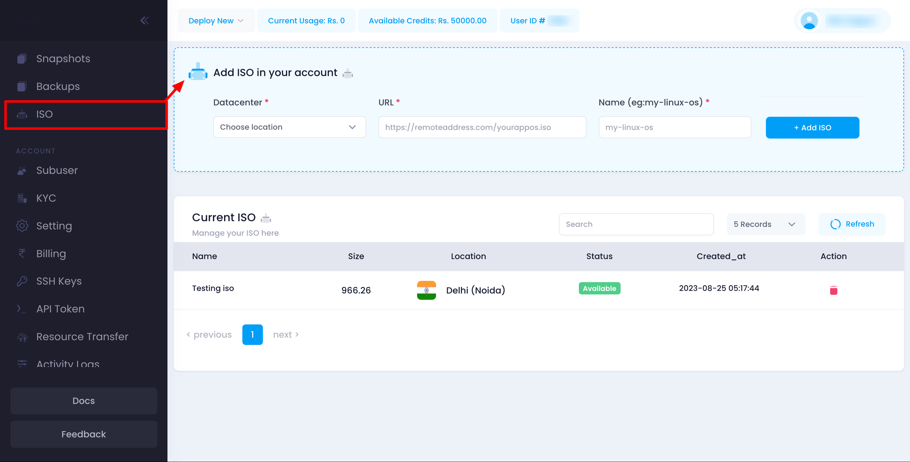
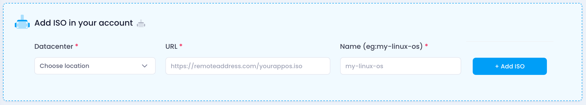
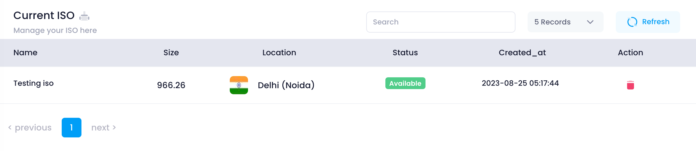

Utho's ISO Management feature allows users to add, view, and manage ISO files, which can be used for creating custom server installations. This guide provides detailed instructions on how to manage ISO files within the Utho platform.

### Navigating the ISO Management Page

The ISO Management page displays a list of all ISO files associated with your account. This helps you manage the ISOs you have uploaded and ensures they are correctly associated with your preferred data centers.

1. **Accessing ISO Management:**

   * Navigate to your account settings.
   * Click on the **ISO** tab to view the list of ISO files.

#### Adding a New ISO

To add a new ISO file to your account, follow these steps:

1. **Access the Add ISO Section:**
   * Scroll to the **Add ISO** section on the ISO Management page.
2. **Fill Out the ISO Form:**
   * **Datacenter:** Select the data center where you want the ISO to be stored.
   * **URL:** Enter the URL from which the ISO file will be downloaded.
   * **Name:** Provide a descriptive name for the ISO file (e.g., `my-linux-os`).
3. **Add the ISO:**
   * Click the **Add ISO** button to upload the ISO file.
   * The ISO will be downloaded from the provided URL and added to your account.

### Managing ISO Files

#### Viewing ISO Files

On the ISO Management page, you will see a table listing all the ISO files associated with your account. This table includes:

* **Name:** The name you assigned to the ISO file.
* **Size:** The size of the ISO file.
* **Location:** The data center where the ISO is stored.
* **Created At:** The date and time the ISO was added.
* **Status:** The current status of the ISO file.
* **Delete Button:** Allows you to delete the specific ISO file.

### Deleting an ISO

If an ISO file is no longer needed or you want to remove it from your account, you can delete it easily:

1. **Identify the ISO:**
   * Review the list of ISO files in the table.
   * Identify the ISO you want to delete by its name, size, and location.
2. **Delete the ISO:**
   * Click the **Delete** button next to the ISO entry.
   * Confirm the deletion when prompted. This will immediately remove the ISO file from your account and data center.

### Ensuring ISO Management Efficiency

1. Managing your ISO files carefully is crucial for maintaining the efficiency and organization of your server installations. Follow these best practices:

   1. **Use Descriptive Names:**
      * Assign descriptive names to your ISO files to easily identify their contents.
   2. **Select Appropriate Data Centers:**
      * Ensure you select the correct data center location for your ISO files to optimize server deployments.
   3. **Regularly Review ISOs:**
      * Periodically review your ISO files and delete any that are no longer needed.

   ### Troubleshooting

   #### Common Issues

   * **ISO Not Added:**
     * Ensure all required fields are filled out correctly and the URL is valid before submitting the form.
   * **Cannot Delete ISO:**
     * Ensure you have the necessary permissions to delete the ISO file. Contact support if the issue persists.

   ### Support

   If you need further assistance with managing ISO files or encounter any issues, contact Utho support through the support ticket system or via email at [support@utho.com]().
