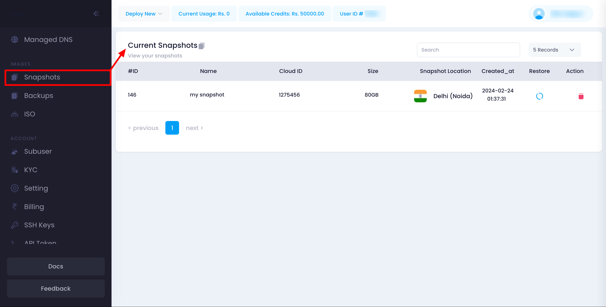
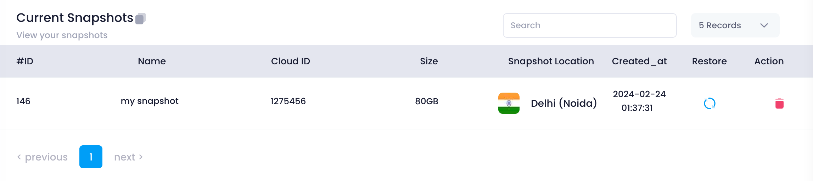

Utho's Snapshot Management feature allows users to view and manage snapshots of their server instances. This guide provides detailed instructions on how to access and utilize the snapshot management features within the Utho platform.

### Navigating the Snapshot Management Page

The Snapshot Management page displays a list of all snapshots associated with your account's server instances. This helps you keep track of your snapshots and ensures they are readily available for restoration when needed.

1. **Accessing Snapshot Management:**
   * Navigate to your account settings.
   * Click on the **Snapshots** tab to view the list of snapshots.

### Viewing Snapshots

On the Snapshot Management page, you will see a table listing all the snapshots associated with your account's server instances. This table includes:

* **ID:** The unique identifier for the snapshot.
* **Name:** The name you assigned to the snapshot.
* **Cloud ID:** The unique identifier for the associated cloud instance.
* **Size:** The size of the snapshot file.
* **Snapshot Location:** The location where the snapshot is stored.
* **Created At:** The date and time the snapshot was created.
* **Restore Button:** Allows you to restore the specific snapshot.
* **Action Button:** Allows you to perform additional actions such as deleting the snapshot.

### Managing Snapshots

#### Restoring a Snapshot

To restore a snapshot, follow these steps:

1. **Identify the Snapshot:**
   * Review the list of snapshots in the table.
   * Identify the snapshot you want to restore by its ID, Name, Cloud ID, and creation date.
2. **Restore the Snapshot:**
   * Click the **Restore** button next to the snapshot entry.
   * Confirm the restoration when prompted. This will initiate the process to restore your server instance from the selected snapshot.

#### Deleting a Snapshot

If a snapshot is no longer needed or you want to free up storage space, you can delete it:

1. **Identify the Snapshot:**
   * Review the list of snapshots in the table.
   * Identify the snapshot you want to delete by its ID, Name, Cloud ID, and size.
2. **Delete the Snapshot:**
   * Click the **Action** button next to the snapshot entry.
   * Select the **Delete** option.
   * Confirm the deletion when prompted. This will immediately remove the snapshot from your account and storage location.

### Ensuring Snapshot Management Efficiency

Managing your snapshots carefully is crucial for maintaining the safety and integrity of your server data. Follow these best practices:

1. **Use Descriptive Names:**
   * Assign descriptive names to your snapshots to easily identify their contents and associated instances.
2. **Regularly Review Snapshots:**
   * Periodically review your snapshots and delete any that are no longer needed.
3. **Monitor Snapshot Sizes:**
   * Regularly check the size of your snapshots to manage storage efficiently.

### Troubleshooting

#### Common Issues

* **Snapshot Not Created:**
  * Ensure all required fields are filled out correctly and the cloud instance is available before initiating a snapshot.
* **Cannot Restore Snapshot:**
  * Ensure you have the necessary permissions to restore the snapshot. Contact support if the issue persists.
* **Cannot Delete Snapshot:**
  * Ensure you have the necessary permissions to delete the snapshot. Contact support if the issue persists.

### Support

If you need further assistance with managing snapshots or encounter any issues, contact Utho support through the support ticket system or via email at [support@utho.com]().
