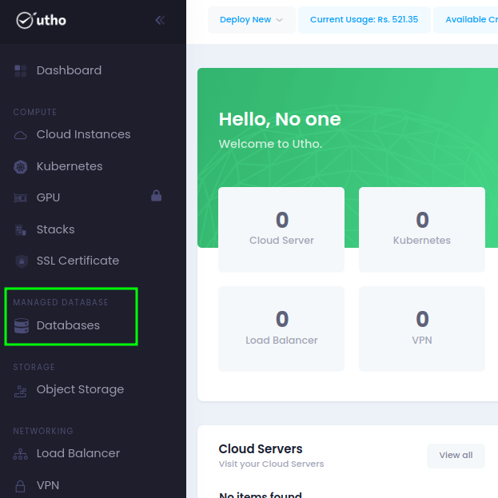
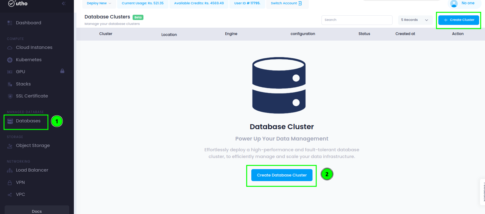
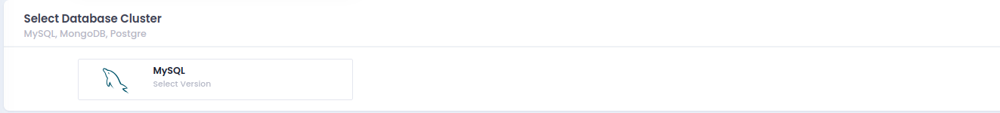
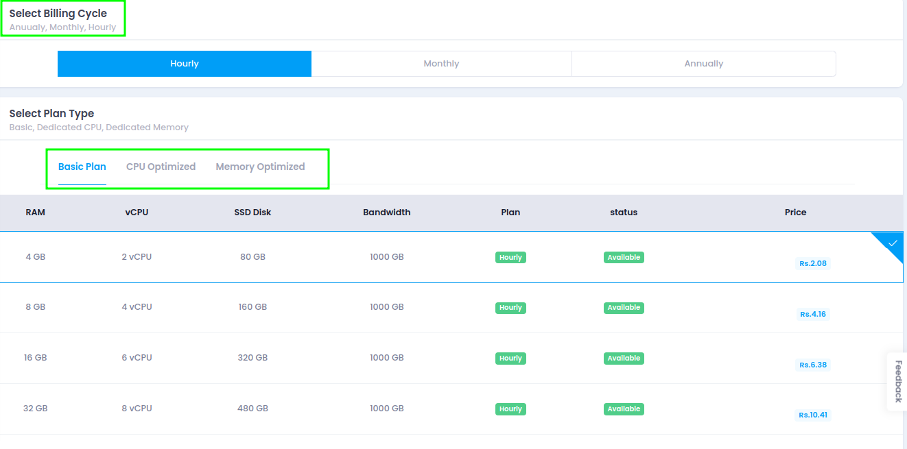

## Introduction:

Utho managed databases are a high-performance database cluster service that is completely managed. An effective substitute for manually installing, setting, maintaining, and safeguarding databases is to use managed databases. Every database cluster has automated failover, which means that malfunctioning or deteriorating nodes are automatically identified and replaced.

## Steps to setup Utho managed database cluster:

Step 1: **Login to Your Utho Profile:** Access the Utho Cloud platform and log in to your profile.

Step 2: **Select Database from the Side Menu:** In the dashboard, navigate to the side menu and choose the 'Database' option.

Step 3: **Click on "Create Database Cluster" Button:** Within the Database section, locate and click on the "Create Database Cluster" button to initiate the setup process.

Step 4: **Select the Data Location:** Choose the preferred data location where your database cluster will be hosted.

Step 5: **Select the MySQL Database Engine:** Right now, we provide MySQL database engines. Opt for the MySQL database engine to power your cluster.

Step 6: **Select the Desired Configuration of the Cluster:** Choose the configuration plan according to your requirements.

Step 7: **Select the Number of Nodes and Enter the Cluster Name:** Define the number of nodes in your cluster and assign a unique name to it.

Step 8: **Click on "Create Cluster" Button:** Finalize the process by clicking on the "Create Cluster" button, initiating the creation of your managed database cluster.

And this is how easily you can setup a fully managed database cluster on Utho platform for your application.
