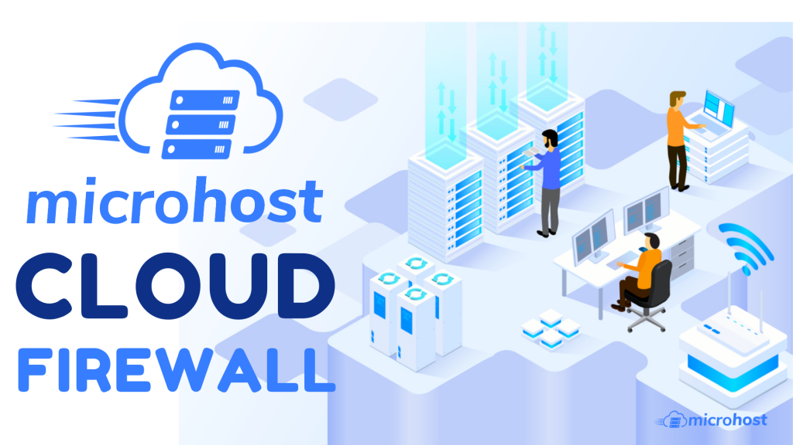
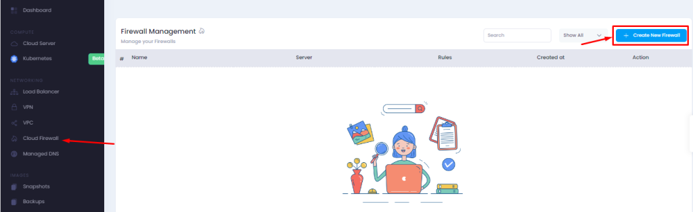
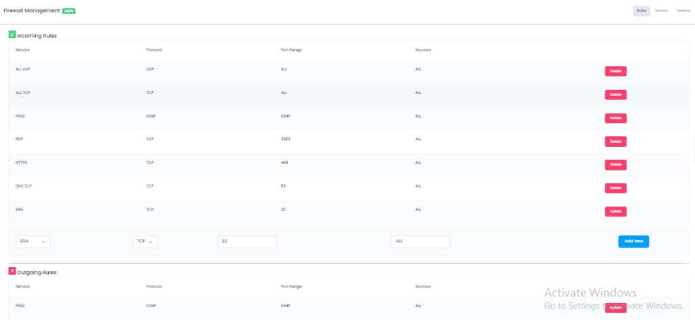

Cloud Firewall is an extra layer of security for the cloud server which prevent unauthorized/unwanted traffic for your cloud server. It will only allow the traffic which is known to it. Inbound and Outbound both connection can be controlled through the cloud firewall. We will See, how we can create and configure the Cloud Firewall.

**Step 1:** First, we have to Login into [Microhost Cloud Dashboard](https://cloud.microhost.com/) -

Step 2: After successful login, we will move to the Cloud Firewall section as given in the screenshot: 

Step 3: In the Cloud Firewall option, we have to click on “Create New Firewall” as  given in the screenshot:

Step 4: Output will be shown as similar like given in the screenshot, where we have to write the name of the Firewall. It could be anything like (Test, Myfirewall  etc.) 

Step 5: After clicking on create firewall, a firewall with some predefined policies would be created as shown in the screenshot. You can manage those policies as per your requirement. 

Suppose if you want to open port 443 for service "https" then you can create a rule as shown in screenshot.

Step 6: After creating a firewall we have to add the server respectively for which we want to apply these policies. We can add single or multiple servers for single firewall as per the requirement. 

Step 7: We can remove the added server from firewall and delete the firewall as well. 

Thank you.
