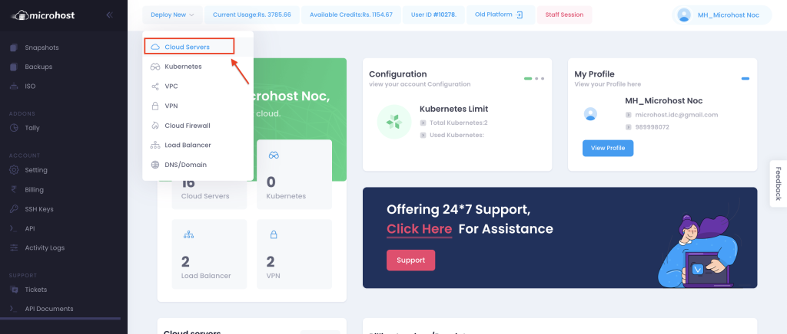
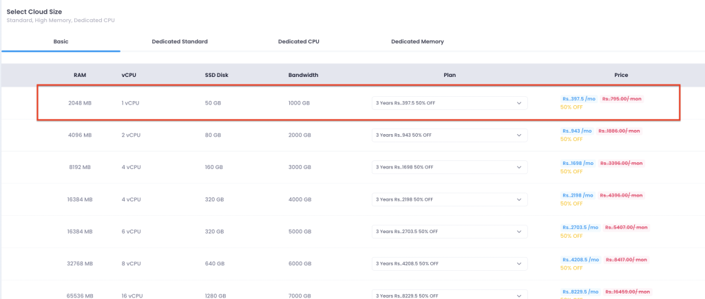
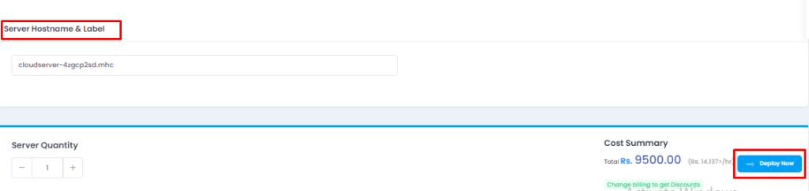

A cloud server is a virtual server that runs on a cloud computing environment (rather than a physical server). It is built and hosted through the Internet and can be accessed on a cloud computing platform from a remote protocol. Also called virtual servers: 

DEPLOYING CLOUD SERVERS USING MICROHOST CLOUD DASHBOARD 

Step 1: Firstly, we have to login into the [Microhost Cloud Dashboard](https://cloud.microhost.com/) Afterward, you will see the interface like below:

Step 2: Now, we have to click on Deploy Cloud Server as per the screenshot given below.

Step 3: Afterward, we will see a new page, where we have to select the configuration and data center location as per given in the screenshot.

Step 4: In the below screenshot we have to select the configuration

Step 5: Now after going below on the same page , we will get the option of writing server hostname along with the button of deploy cloud server. Please see the screenshot for your reference. 

After clicking on “deploy cloud server” , the server will be created of selected configuration. We can see the IP and other details in the “cloud server” section of the dashboard.

Thankyou
