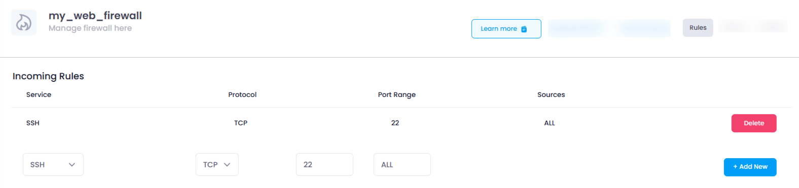
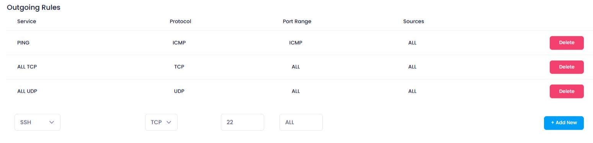
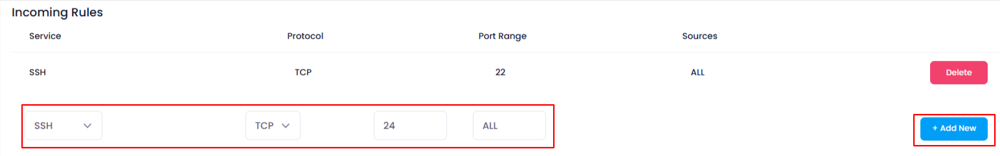
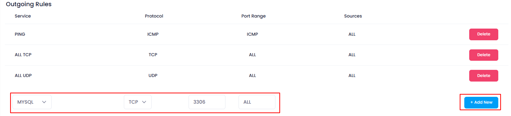
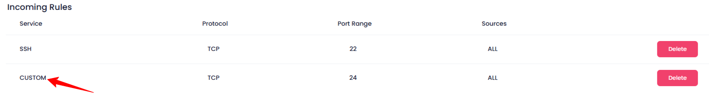
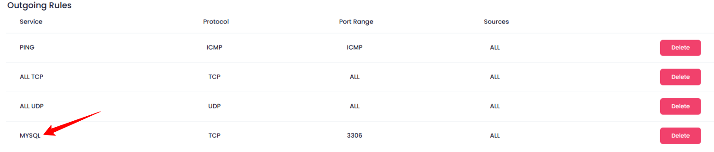

## **How to Add Rules in Firewall**

### **Introduction to Firewall Rules**

In Utho Cloud, firewalls are used to manage the traffic that is allowed or blocked for your network. You can configure specific rules to control incoming and outgoing traffic. This allows you to define which services or applications can communicate with your network and which ones should be restricted.

---

### **Steps to Add Rules in Firewall**

#### **1. Log into Your Utho Cloud Platform Account**

* Visit the **Utho Cloud Platform** [login](https://console.utho.com/login) page.
* Enter your credentials and click  **Login** .
* If you’re not registered, sign up [here](https://console.utho.com/signup).

#### **2. Navigate to the Firewall Listing Page**

* After logging in, go to the **Firewall Listing Page** from the navigation menu or the dashboard.
* To directly access this page you can click [here](https://console.utho.com/firewall "Firewall Listing Page").

#### **3. Select the Firewall You Want to Modify**

* Find the firewall you wish to add rules to, and click on the **Manage** button next to it. This will take you to the firewall's  **Manage Page** .

  

#### **4. Go to the Rules Section**

* Upon arriving at the  **Manage Page** , you will find a **Rules** section at the top right corner of the page.
* By default, you will land on the **Rules** section.
* If you are not already in the **Rules** section, simply click on the **Rules** tab at the top-right corner of the page to access the section.

#### **5. Understand Incoming and Outgoing Rules**

In this section, you will find two types of rules: **Incoming Rules** and  **Outgoing Rules** .

* **Incoming Rules** : These rules govern the traffic that comes into your network from external sources (e.g., the internet). It controls which services and devices can connect to your system.
* **Outgoing Rules** : These rules control the traffic that leaves your network and reaches external services or devices. They define which services and servers your network can communicate with.

  

  

#### **6. Adding New Rules**

You can add new rules for both **incoming** and **outgoing** traffic directly through the provided input fields by clicking the **Add New** buttons:

* **To Add Incoming Rules** : Click the **"Add New"** button under the **Incoming Rules** section.
* **To Add Outgoing Rules** : Click the **"Add New"** button under the **Outgoing Rules** section.

Upon clicking these buttons, the rule will be added to the firewall immediately.

---

### **7. Configuring Rule Inputs**

When adding a new rule, you will need to fill out the following fields that are provided in the form:

* **Service** :

  A dropdown menu that allows you to select the type of traffic or service for the rule. Some common services include:

* **SSH** : For secure remote login via SSH.
* **RDP** : For remote desktop connections.
* **HTTP** : For web traffic.
* **HTTPS** : For secure web traffic.
* And other services like  **FTP** ,  **SMTP** , etc.
* **Protocol** :

  A dropdown that allows you to select the protocol for the rule. The default is  **TCP** , which is commonly used for reliable communication. You can also select other protocols like **UDP** or **ICMP** based on your requirements.

* **Port Range** :

  Numeric inputs for specifying the port or range of ports the rule will apply to. For example:

* For **HTTP** traffic, you can enter  **80** .
* For  **HTTPS** , enter  **443** .
* If you need a range, such as for an FTP service, you might enter a range like  **1024-65535** .
* **Sources** :

  This input defines the source IP addresses that the rule will apply to. By default, the value is set to  **ALL** , which means the rule will apply to all source IPs.

* You can modify this to specify particular IP addresses, IP ranges, or subnets for more granular control over which sources can access your services.

---

### **8. Save the Rule**

After you have entered all the necessary information for the rule, click on the **"Add New"** button next to the respective **Incoming** or **Outgoing** section. This will save the rule and apply it to the firewall configuration.

---

### **9. Verify the Rule**

After adding the rule, it will appear in the **Incoming Rules** or **Outgoing Rules** list. You can verify the following:

* **Service** : Ensure the correct service is listed.
* **Protocol** : Check that the correct protocol is applied.
* **Port Range** : Verify the correct port or port range is configured.
* **Source** : Ensure the correct source IP addresses or range is specified.

  

  

---

### **Conclusion**

By following these steps, you can easily configure incoming and outgoing rules to control the traffic flow in and out of your network. This ensures that your firewall is correctly configured to allow or block specific services, improving the security and performance of your system.
