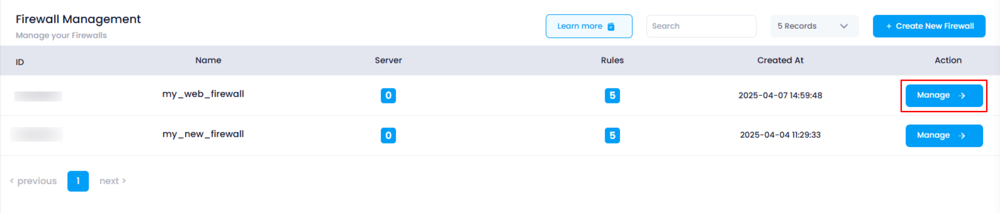
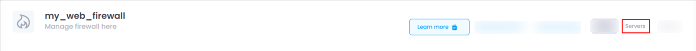
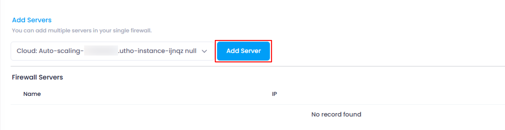
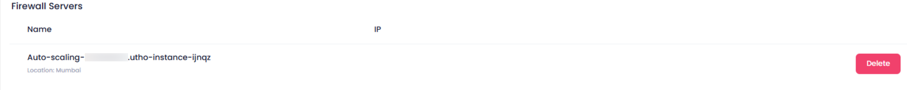

# **How to Add Servers in Firewall**

This guide will walk you through the process of adding servers to your firewall. With this feature, you can connect and manage multiple servers like cloud servers, IPsec instances, auto-scaling instances, etc., to a single firewall. Follow these steps to add servers to your firewall.

### **1. Log in to Utho Cloud Platform**

* Visit the Utho Cloud Platform's **[login page](https://console.utho.com/login "Login")** .
* Enter your credentials and click  **Login** .
* If you're not registered, sign up  **[here](https://console.utho.com/signup "Signup")** .

### **2. Navigate to the Firewall Listing Page**

* After logging in, go to the **Firewall Listing Page** where you can see all the firewalls deployed in your account.
* You can click [here](https://console.utho.com/firewall "Firewall Listing Page"), to directly access the listing page of firewalls.

### **3. Select the Firewall to Manage**

* Find the firewall to which you want to add a server.
* Click the **"Manage"** button next to the selected firewall to access its manage page.

  

### **4. Go to the Servers Section**

* On the **Manage Page** of the firewall, look at the top-right corner of the page.
* Click on the **"Servers"** tab to open the **Servers** section.

  

### **5. Select Servers to Add**

* In the **Servers** section, you will see a dropdown list containing available servers and instances that can be connected to the firewall.
* Select a server or instance you wish to add from the dropdown list.

  

### **6. Add the Selected Server**

* After selecting the desired server or instance, click the **"Add Server"** button next to the dropdown.
* The selected server will be added to the firewall.

### **7. Verify the Server Addition**

* The **Servers List** below the **Add Server** section will automatically reflect the newly added server.
* You can check this list to verify that the server has been successfully attached to the firewall.

  

By following these steps, you can easily add multiple servers to a single firewall in Utho Cloud and manage their security effectively.
