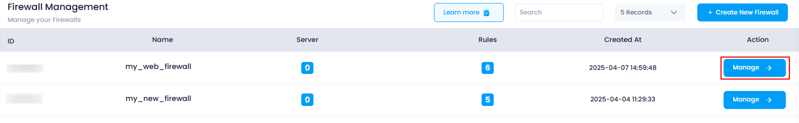
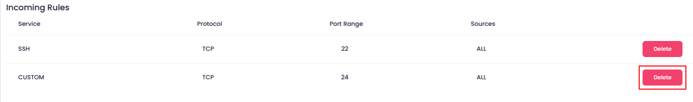
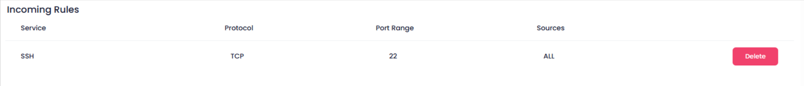

# **How to Delete Rules in Firewall**

This guide will walk you through the process of deleting custom or default firewall rules in the Utho Cloud Platform. You can easily remove unwanted rules from both incoming and outgoing traffic to manage your firewall configuration effectively. Simply follow the steps below to delete any rule from the list.

### **1. Log in to Utho Cloud Platform**

* Visit Utho Cloud Platform's **[login page](https://console.utho.com/login)** .
* Enter your credentials and click  **Login** .
* If you're not registered, sign up  **[here](https://console.utho.com/signup)** .

### **2. Navigate to the Firewall Listing Page**

* After logging in, go to the  **Firewall Listing Page** .
* You can directly access the listing page for Firewalls by clicking [here](https://console.utho.com/firewall "Firewalls Listing Page").
* Here, you will see all the firewalls that have been deployed.

### **3. Select the Firewall to Manage**

* Find the firewall for which you need to delete a rule.
* Click on the **"Manage"** button next to the selected firewall to access its manage page.

  

### **4. Go to the Rules Section**

* Upon reaching the  **Manage Page** , you will be automatically directed to the **Rules** section.
* If not, click on the **"Rules"** tab located in the top-right corner of the page.

### **5. Identify the Rule to Delete**

* In the **Rules** section, you will see a list of both **Incoming** and **Outgoing** rules.
* Each rule, whether **default** or  **custom** , has a red-colored **"Delete"** button at the end.

### **6. Delete the Rule**

* Click the **"Delete"** button next to the rule you wish to remove.
* A **confirmation popup** will appear asking if you’re sure about deleting the rule.
* Click **OK** to confirm the deletion.

  

### **7. Verify Deletion**

* Once confirmed, the rule will be deleted.
* You can verify the deletion by checking the **Incoming** or **Outgoing Rules** list to ensure the rule has been successfully removed.

  
